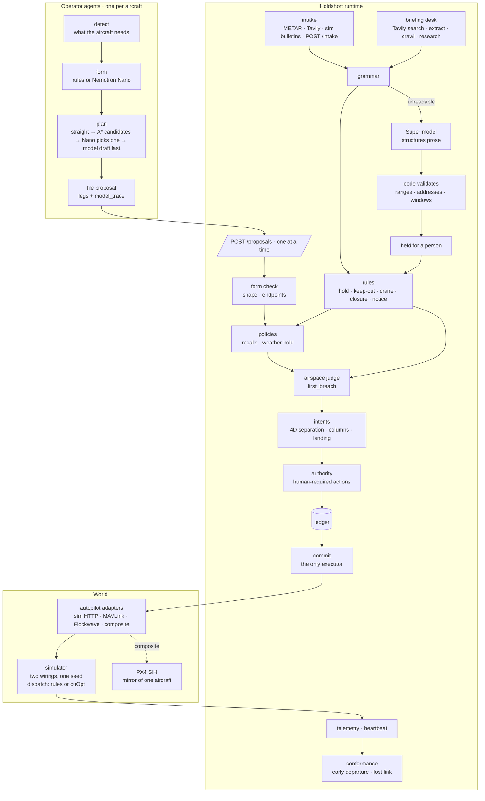

# Architecture

Holdshort is three processes and a world. Agents file. The runtime judges, records and commands. The world
answers with telemetry. There is no fourth path.



## Components

| Component | Path | Role |
|---|---|---|
| Operator agent | `holdshort/agent/` | One process per aircraft. Reads telemetry through the runtime, detects a concern, writes a request form (rules or a per-drone Nemotron Nano) and files the straight line first. Reacts to refusals: climb, wait, the planner's candidates in the order its model chose, a model draft as the last resort, decline. Registers its model every 30 s with `model_ok`. |
| Route chooser | `holdshort/agent/chooser.py` | Gives the aircraft's Nano the planner's candidates and one tool, `choose_route(id, reason)`. Asks in JSON when the server has no tools. When there is no valid answer the rules pick: (c) when traffic is in the way, else (a). Writes no geometry. |
| Model trace | `holdshort/agent/trace.py` | `params.model_trace` on every filing, under 1 KB: who wrote the form, where the route came from (`straight`, `choice`, `draft`, `astar`), the candidates and the reason. For the map's hover card; the runtime never reads it. |
| Runtime | `holdshort/runtime/` | Judges every proposal, holds locks and 4D intents, writes the ledger before executing, executes through an adapter, watches conformance and link heartbeat, absorbs notices, intake and the briefing, writes advisories. The only thing that commands an aircraft. |
| Judge | `holdshort/core/geo.py` | `first_breach(airspace, legs)`: the single geometric judgement used by the runtime, the planner's self-check and the tests. Buildings, cells, zones, clearances, lateral separation. |
| Planner | `holdshort/core/route.py` | The operator's A* on a 50 m grid with per-leg altitude. Draws up to three candidates: (a) shortest, (b) lowest altitude, (c) clear of other aircraft's corridors and keep-out areas. Lives in the agent, never in the runtime. |
| Intake | `holdshort/runtime/intake.py`, `holdshort/core/intake.py`, `holdshort/core/tavily.py`, `holdshort/core/metar.py` | Sources → items → grammar → (Super model) → code validation → rules. Store in SQLite (`INTAKE_DB`). |
| Briefing desk | `holdshort/runtime/briefing.py` | Asks Tavily about the places and day being flown: at round start, and when a newly cleared corridor enters a ~1 km cell not briefed this round. Grammar reads, the Super model structures what it cannot, code validates, every rule keeps its citation. Runs on its own thread; recorded fixtures when there is no key. |
| Adapters | `holdshort/adapters/` | The only code that touches an aircraft. `ADAPTER` picks MAVLink, Flockwave or composite; anything else is the simulator over HTTP. Composite: the simulator stays the world of record for all four aircraft, and `MAVLINK_MIRROR` (default drone-01) is also flown by PX4. PX4's answers go to `AUTOPILOT_LOG` and `/state.autopilots` and never change a verdict. |
| Simulator | `sim/` | Two worlds from one seed. Guarded: aircraft move only on runtime commands. Direct: the same agents drive the autopilot themselves. Scoreboards for both. Scripted bulletins: NOTAM, airworthiness recall, MEDEVAC prose, weather, incident, lost link. |
| Dispatcher | `sim/dispatch.py` | Which drone takes which delivery, in which order. The operator's call, played by the simulator. Rules by default; with `DISPATCH=cuopt` and `CUOPT_URL` an NVIDIA cuOpt server decides, and any failure or delay falls back to the rules for that stop. The runtime never reads it. |
| Map and inbox | `ui/` | Static MapLibre page reading `/state` and `/compare`: hover card for model traces, tower briefing panel, tower lines, PX4 ghost, `?demo=1` director. Approval inbox for a human controller. |

## The two links

```mermaid
sequenceDiagram
    participant A as agent (drone-02)
    participant R as runtime
    participant X as aircraft
    A->>R: GET /telemetry
    A->>R: POST /proposals (fly_route, legs)
    R->>R: form · policies · airspace · intents · authority
    R->>R: ledger line (pending)
    R->>X: command (adapter)
    X-->>R: telemetry
    R->>R: ledger line (done) · intent live
    R-->>A: decision (auto / denied / human)
    Note over A,R: if this link drops, the aircraft is unaffected
    Note over R,X: if this link drops, the aircraft flies its cleared route and lands; the runtime keeps the space reserved
```

Agents never hold an actuator. In `compose.yaml` the guarded agents are on a network that cannot reach the
simulator; the direct agents are on the one that can. Same code, different wiring — that is the experiment.

## Judgement, in order

Filings are judged one at a time. One lock (`_judging` in `holdshort/runtime/service.py`) is held from the form
check to the 4D intent registration, and queued resource grants take the same lock. Found live: two recalled
drones re-filed 0.2 s apart onto the same corridor, and both passed before either intent existed.
`tests/test_intents.py` covers it.

1. **Form.** Numeric legs, inside the service box, first point at the aircraft, last point at the destination.
2. **Policies.** Airworthiness recalls, weather holds (ground-only), anything a person banned.
3. **Airspace.** `first_breach` over every leg: polygon crossings and lateral gaps against buildings
   (roof + clearance), FAA cells (ceiling, 0 ft cells forbidden), zones, incident circles and briefing rules
   (crane columns, event and restriction circles), default 400 ft ceiling. Takeoff and landing columns are
   judged as vertical legs; a closed landing area counts only at landing.
4. **Intents.** The route becomes a 4D volume (30 m lateral, 25 m vertical, ±30 ticks, nav tolerance added on
   the other side). Conflict with any live intent, a parked aircraft within 30 m of the landing point, or a
   landing area someone else is due at → refused with the other aircraft named and the tick it clears.
5. **Authority.** Actions and blast radii that always need a person go to the inbox.
6. **Ledger, then commit.** The line carries the tick, airspace revision, checks run, intent id and who
   authored the request. Re-judged right before execution if it waited.
7. **Conformance.** Telemetry against the cleared volumes: early departures are re-anchored and noted;
   a silent aircraft becomes `link_lost` with its space held; on return, a conformance line.

Refusals carry values, not prose: `blocked_kind`, `blocked_volume`, `blocked_asset`, `blocked_until_tick`.
The map turns them into words.

## Intake

| Source | Trust | Applied |
|---|---|---|
| Simulator bulletins | trusted | at once when the grammar reads them |
| METAR (aviationweather.gov) | trusted | at once; numbers only |
| Briefing page from an official domain, read by the grammar | trusted | at once; these rules only tighten |
| Briefing page from any other domain; Tavily research's structured answers | untrusted | held for a person |
| Tavily search, manual `POST /intake` | untrusted | held for a person even when the grammar reads them |
| Prose the grammar cannot read | model | the Super model structures it; code validates ranges, addresses (against the address list) and windows; held for a person |

Official means a domain in `briefing.trusted_domains` in `configs/fleet.yaml` (faa.gov, weather.gov, noaa.gov,
nyc.gov, nycgovparks.org, cityofnewyork.us) or one of its subdomains. When Tavily research points at an
official page, the tower fetches that page and the grammar reads it; only if that fails does the structured
answer stand, and then it waits for a person.

Weather above `configs/fleet.yaml` limits opens a fleet-wide takeoff hold. Incidents become forbidden
circles around a building. Both tighten immediately. Lifting early is a card in the inbox; otherwise expiry.

The briefing turns what it reads into rules of three shapes. A tower crane is a temporary obstacle: a 30 m
circle up to the crane's height, with 50 m of vertical clearance. A closed park or pier makes that landing
area unusable for the window. An event or a flight restriction is a keep-out circle. Code checks each first:
the address, building or landing area must resolve against the tower's own lists, crane heights 10–400 m,
radii 50–5,000 m, windows capped at 6,000 ticks. A weather advisory is information only; the takeoff hold
comes from METAR. Every rule carries its source URL, title, domain and fetch time into the ledger, the intake
store and `/state.briefing`. Without a Tavily key the same scenes come from `tests/fixtures/tavily` and say
"recorded" everywhere. `TAVILY_BUDGET_PER_ROUND` (default 20 credits) is shared with the periodic search.

Every item and every rule that came of it is kept in SQLite (`INTAKE_DB`, on the runtime's data volume in
compose). A restart does not read a searched page or a typed line twice. An item that was still waiting for a
person comes back as a card once; one a person already answered stays answered. METAR is the current
observation, so a new round puts the last one back at once instead of waiting for the next fetch, and a failed
fetch keeps the last observation rather than lifting a hold.

## Models

| Tier | Where | Does | Never |
|---|---|---|---|
| Nano (Nemotron Nano 4B locally, Nemotron 3.5 Lightning on Nebius) | one per aircraft | writes the request form; picks one of the planner's candidates by calling `choose_route`; drafts waypoints only after every candidate is refused | judges, executes |
| Super (Nemotron 3 Super 120B on Nebius; 4B stand-in on the local tower server) | beside the runtime | structures prose notices, incidents and briefing pages, writes the briefing and advisory summaries | applies anything without code validation and, for prose, a person |
| Ultra (optional) | beside the runtime | picks among already-legal proposals with a one-line reason | picks outside the list |

Fallback is automatic: Nebius key → Nebius; else a local Ollama fleet if it answers (drones on 11435–11438,
the tower on 11439, else 11434); else rules only. The map shows the model behind every request and corridor.
An aircraft is labelled `rules` when every ask since its last registration (30 s) fell back to the rules for
its forms and route choices. Route drafts are not counted.

## Data

`configs/airspace/nyc_buildings.json` — 34,581 OpenStreetMap buildings of 20 m and taller from the same map
tiles the screen draws, with per-building clearance derived from the FAA cell above it.
`configs/airspace/nyc.json` — FAA UAS Facility Map cells for KLGA/KJFK/KEWR with 0/100/200/300/400 ft
ceilings. `configs/airspace/nyc_addresses.json` — real addresses used as delivery points and for geocoding
incident reports. `configs/fleet.yaml` — resources, authority, performance, weather limits, dispatch, intake
queries, briefing. `tests/fixtures/tavily` — hand-written pages in Tavily's response shape for the recorded
briefing; not real notices.

## Interfaces

Runtime: `POST /proposals`, `POST /approve`, `POST /deny`, `GET /state`, `GET /telemetry/{asset}`,
`GET /airspace`, `GET /ledger/report`, `POST /intake`, `POST /briefing/run`, `POST /agents/register`,
`GET /health`. Simulator: `GET /compare`, `GET /state`, `GET /bulletins`, `POST /act`, `POST /reset`,
`GET /health`. Everything is JSON over HTTP with no dependencies beyond the standard library and `pyyaml`;
the MAVLink adapters add `pymavlink`.

`GET /state` carries `briefing` (mode, source, credits, summary, items with their citations) and `autopilots`
(what PX4 answered; empty unless the adapter has a mirror). `POST /briefing/run` asks again at the next poll;
503 when the briefing is off, 409 while one is running.

`POST /agents/register` is a label, not a permission. An agent says which model writes its forms and whether
that model's answers have been used since it last said so. The runtime accepts only aircraft that are in the
world's telemetry (503 until the world has arrived, 404 for anyone else) and drops an agent that has been
silent for two minutes.

Ledger codes you will meet: `within_limits`, `airspace`, `policy`, `human_action`, `duplicate`, `recalled`,
`withdrawn`, `nonconforming`, `weather_hold`, `incident_keepout`, `intake_received`, `intake_unreadable`,
`intake_source_failed`, `intake_source_recovered`, `briefing_run`, `briefing_item`, `briefing_rule`,
`advisory`, `link_lost`, `link_restored`, `notice_published`, `notice_lapsed`. PX4's answers are not ledger
lines; they go to `autopilot.jsonl` beside the ledger.
