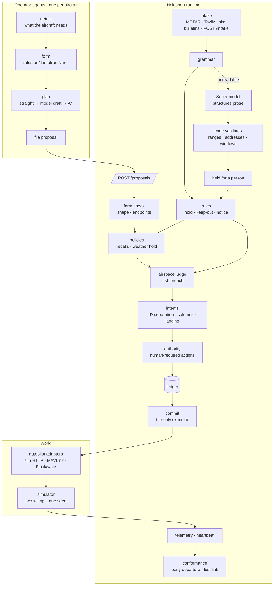

# Architecture

Holdshort is three processes and a world. Agents file. The runtime judges, records and commands. The world
answers with telemetry. There is no fourth path.



## Components

| Component | Path | Role |
|---|---|---|
| Operator agent | `holdshort/agent/` | One process per aircraft. Reads telemetry through the runtime, detects a concern, writes a request form (rules or a per-drone Nemotron Nano), attaches a route it drew itself, files it. Reacts to refusals: model redraft, A* redraw, climb, wait, decline. Registers the model it runs. |
| Runtime | `holdshort/runtime/` | Judges every proposal, holds locks and 4D intents, writes the ledger before executing, executes through an adapter, watches conformance and link heartbeat, absorbs notices and intake, writes advisories. The only thing that commands an aircraft. |
| Judge | `holdshort/core/geo.py` | `first_breach(airspace, legs)`: the single geometric judgement used by the runtime, the planner's self-check and the tests. Buildings, cells, zones, clearances, lateral separation. |
| Planner | `holdshort/core/route.py` | The operator's A* on a 50 m grid with per-leg altitude. Lives in the agent, never in the runtime. |
| Intake | `holdshort/runtime/intake.py`, `holdshort/core/intake.py`, `holdshort/core/tavily.py`, `holdshort/core/metar.py` | Sources → items → grammar → (Super model) → code validation → rules. Store in SQLite (`INTAKE_DB`). |
| Simulator | `sim/` | Two worlds from one seed. Guarded: aircraft move only on runtime commands. Direct: the same agents drive the autopilot themselves. Scoreboards for both. Scripted bulletins: NOTAM, airworthiness recall, MEDEVAC prose, weather, incident, lost link. |
| Map and inbox | `ui/` | Static MapLibre page reading `/state` and `/compare`; approval inbox for a human controller. |

## The two links

```mermaid
sequenceDiagram
    participant A as agent (drone-02)
    participant R as runtime
    participant X as aircraft
    A->>R: GET /telemetry
    A->>R: POST /proposals (fly_route, legs)
    R->>R: form · policies · airspace · intents · authority
    R->>R: ledger line (pending)
    R->>X: command (adapter)
    X-->>R: telemetry
    R->>R: ledger line (done) · intent live
    R-->>A: decision (auto / denied / human)
    Note over A,R: if this link drops, the aircraft is unaffected
    Note over R,X: if this link drops, the aircraft flies its cleared route and lands; the runtime keeps the space reserved
```

Agents never hold an actuator. In `compose.yaml` the guarded agents are on a network that cannot reach the
simulator; the direct agents are on the one that can. Same code, different wiring — that is the experiment.

## Judgement, in order

1. **Form.** Numeric legs, inside the service box, first point at the aircraft, last point at the destination.
2. **Policies.** Airworthiness recalls, weather holds (ground-only), anything a person banned.
3. **Airspace.** `first_breach` over every leg: polygon crossings and lateral gaps against buildings
   (roof + clearance), FAA cells (ceiling, 0 ft cells forbidden), zones and incident circles, default 400 ft
   ceiling. Takeoff and landing columns are judged as vertical legs.
4. **Intents.** The route becomes a 4D volume (30 m lateral, 25 m vertical, ±30 ticks, nav tolerance added on
   the other side). Conflict with any live intent, a parked aircraft within 30 m of the landing point, or a
   landing area someone else is due at → refused with the other aircraft named and the tick it clears.
5. **Authority.** Actions and blast radii that always need a person go to the inbox.
6. **Ledger, then commit.** The line carries the tick, airspace revision, checks run, intent id and who
   authored the request. Re-judged right before execution if it waited.
7. **Conformance.** Telemetry against the cleared volumes: early departures are re-anchored and noted;
   a silent aircraft becomes `link_lost` with its space held; on return, a conformance line.

Refusals carry values, not prose: `blocked_kind`, `blocked_volume`, `blocked_asset`, `blocked_until_tick`.
The map turns them into words.

## Intake

| Source | Trust | Applied |
|---|---|---|
| Simulator bulletins | trusted | at once when the grammar reads them |
| METAR (aviationweather.gov) | trusted | at once; numbers only |
| Tavily search, manual `POST /intake` | untrusted | held for a person even when the grammar reads them |
| Prose the grammar cannot read | model | the Super model structures it; code validates ranges, addresses (against the address list) and windows; held for a person |

Weather above `configs/fleet.yaml` limits opens a fleet-wide takeoff hold. Incidents become forbidden
circles around a building. Both tighten immediately. Lifting early is a card in the inbox; otherwise expiry.

Every item and every rule that came of it is kept in SQLite (`INTAKE_DB`, on the runtime's data volume in
compose). A restart does not read a searched page or a typed line twice. An item that was still waiting for a
person comes back as a card once; one a person already answered stays answered. METAR is the current
observation, so a new round puts the last one back at once instead of waiting for the next fetch, and a failed
fetch keeps the last observation rather than lifting a hold.

## Models

| Tier | Where | Does | Never |
|---|---|---|---|
| Nano (Nemotron Nano 4B locally, Nemotron 3.5 Lightning on Nebius) | one per aircraft | writes the request form, drafts a route after a refusal, picks the response to a refusal | judges, executes |
| Super (Nemotron 3 Super 120B on Nebius; 4B stand-in locally) | beside the runtime | structures prose notices and incidents, writes advisory summaries | applies anything without code validation and, for prose, a person |
| Ultra (optional) | beside the runtime | picks among already-legal proposals with a one-line reason | picks outside the list |

Fallback is automatic: Nebius key → Nebius; else a local Ollama fleet if it answers; else rules only. The
map shows the model behind every request and corridor. An aircraft whose model stopped answering is labelled
`rules`, because rules are what wrote its forms.

## Data

`configs/airspace/nyc_buildings.json` — 34,581 OpenStreetMap buildings of 20 m and taller from the same map
tiles the screen draws, with per-building clearance derived from the FAA cell above it.
`configs/airspace/nyc.json` — FAA UAS Facility Map cells for KLGA/KJFK/KEWR with 0/100/200/300/400 ft
ceilings. `configs/airspace/nyc_addresses.json` — real addresses used as delivery points and for geocoding
incident reports. `configs/fleet.yaml` — resources, authority, performance, weather limits, intake queries.

## Interfaces

Runtime: `POST /proposals`, `POST /approve`, `POST /deny`, `GET /state`, `GET /airspace`, `GET /ledger/report`,
`POST /intake`, `POST /agents/register`, `GET /health`. Simulator: `GET /compare`, `GET /state`,
`GET /bulletins`, `POST /act`, `POST /reset`. Everything is JSON over HTTP with no dependencies beyond the
standard library and `pyyaml`.

`POST /agents/register` is a label, not a permission. An agent says which model writes its forms and whether
that model has answered since it last said so. The runtime accepts only aircraft that are in the world's
telemetry (503 until the world has arrived, 404 for anyone else) and drops an agent that has been silent for
two minutes.

Ledger codes you will meet: `within_limits`, `airspace`, `policy`, `human_action`, `duplicate`, `recalled`,
`withdrawn`, `nonconforming`, `weather_hold`, `incident_keepout`, `intake_received`, `intake_unreadable`,
`intake_source_failed`, `advisory`, `link_lost`, `link_restored`, `notice_published`, `notice_lapsed`.
