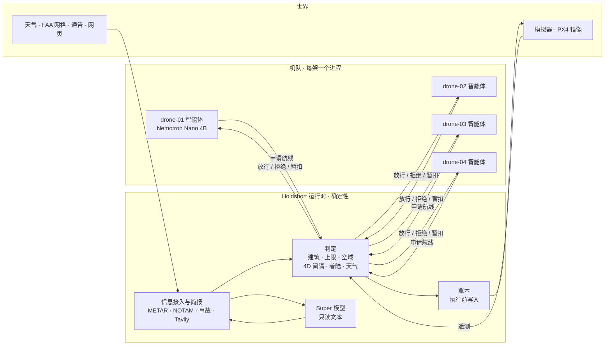

# Holdshort

**智能体提出申请。塔台放行。只有获准的飞行才会移动。**

[English](README.md) · [한국어](README.kr.md)

Holdshort 是面向 AI 运营机队的放行权威运行时。每架无人机都有自己的智能体（小型 Nemotron 模型或纯规则），
由它决定要做什么、申请哪条航线。在运行时依据物理世界——建筑、高度上限、关闭空域、其他航空器、天气、
事故——完成判定、记录并执行之前，什么都不会起飞。判定路径中没有任何模型。演示用同一随机种子把同一
机队跑两遍：一遍经过运行时，一遍由智能体直接操控自动驾驶仪，并计分对比。



两条链路，两种性质。智能体只与运行时通信，且只用于申请。只有运行时能操控航空器。智能体链路断开，
航空器毫无影响；航空器链路断开，它飞完已获准的航线并在那里着陆，运行时为它保留该空间。

## 演示展示的内容

四架无人机从布鲁克林的仓库屋顶向曼哈顿各处的着陆区送货。一轮 5,000 拍（约 17 分钟）。空域关闭、天气暂停、
火灾和链路丢失在固定种子下按固定时刻发生；其余场景随交通而发生。PX4 一行是可选的。

| 场景 | 发生什么 | 谁决定 |
|---|---|---|
| 直线被拒 | 无人机向送货点申请直线，直线穿过一栋建筑。拒绝并点名该建筑 | 判定（代码） |
| 航线选择 | 运营方的规划器最多画出三条合法候选：最短、高度最低、避开其他航空器与禁入区。无人机自己的 Nemotron 调用 `choose_route(id, reason)` 选出一条。运行时像判定其他申请一样判定这一选择 | 模型选择；判定放行或拒绝 |
| 塔台简报 | 每轮开始时，以及新获准的走廊进入本轮还没人问过的约 1 km 网格时，塔台向 Tavily 询问该地点当天的情况：塔吊、活动、公园关闭、飞行限制、天气预警。由此生成的每条规则都带有来源 URL | 语法读取，代码核验。语法读取的官方页面立即生效；其余都等待人工确认 |
| 飞行中空域关闭 | 第 525 拍，一条 NOTAM 关闭直升机坪走廊，drone-03 正在其中。它的航线被撤回，并在 22 拍的离开时限内从最近出口离开。穿过该区域的新航线被拒 | 由语法解析的 NOTAM 判定 |
| 交叉航迹 | 两条航线会在同一时刻相距 30 m 和 25 m 以内。后者被拒并点名对方航空器；其运营方爬升 30 m、等待对方窗口过去，或改报能避开的那条候选 | 判定（4D 意图） |
| 天气暂停 | 一行 METAR 报告阵风 28 kt。一拍之内全队暂停起飞；空中的航空器继续飞行并着陆。提前解除需要人 | 代码将数值与 `configs/fleet.yaml` 比较 |
| 着陆区附近火灾 | 一份报告给出地址。该建筑周围出现 150 m 禁入区；Gantry Plaza 着陆区落在它的 50 m 余量之内，不能使用。种子 7 下没有已获准的走廊穿过这个圆，禁入区存在期间获准的每条航线都避开它 | 语法或 Super 模型读文本；代码核实地址并施加规则 |
| 链路丢失 | 一架航空器失联。它飞完已获准航线并着陆。运行时为它保留剩余走廊直至到期，不向它发送任何东西；重新收到它的信号时，核对其位置是否符合获准内容 | 判定；不向失联航空器发送任何指令 |
| 塔台建议 | 同一原因被拒三次后，运行时列出合法选项，Super 模型可推荐一项。它不执行任何动作 | 代码生成并检查选项 |
| PX4 镜像（可选） | 设置 `ADAPTER=composite` 后，一架受守护的航空器还会由一台真实的 PX4 自动驾驶仪以 SIH 模式同步飞行。其获准航线变成 PX4 任务，撤回会传到自动驾驶仪，被拒的申请什么也不发送 | 运行时下达指令；世界状态仍以模拟器为准 |

地图旁的计分板用同一套规则统计两种接线。种子 7，一轮 5,000 拍，默认接线
（`tests/test_two_worlds.py` 中的 `run()`）：

| 计数项 | 运行时 | 直连 |
|---|---|---|
| 空域违规 | 0 | 48 |
| 上限突破 | 0 | 13 |
| 无记录动作 | 0 | 36（其全部 36 个动作） |
| 间隔丢失 | 0 | 3 |
| 天气暂停期间起飞 | 0 | 2 |
| 送达 | 21 | 20 |

运行时一侧的其他违规计数也都是 0：起降坪冲突、闯入关闭区域、在关闭区域内滞留超过离开时限、着陆点冲突、
闯入事故区、闯入失联保留空间，以及撤回后的违规。它执行了 45 个动作，全部有记录。各计数项的统计方法见
[docs/RULES.md](docs/RULES.md#how-the-scoreboard-counts)。

## 运行

```sh
git clone https://github.com/liebertar/holdshort && cd holdshort
docker compose up --build          # 仅规则，无需密钥
```

地图在 http://localhost:3100/map.html。http://localhost:3100 是给人类管制员用的审批箱。

有密钥时，复制示例文件，填上手头有的：

```sh
cp .env.example .env.local         # NEBIUS_API_KEY, TAVILY_API_KEY
docker compose --env-file .env.local up --build
```

不用 Docker（需要 Python 3.12 和 `pyyaml`）：

```sh
./scripts/dev.sh      # 自行选择 Nebius、本地 Ollama 或纯规则；地图在 http://127.0.0.1:3100/map.html
./scripts/demo.sh     # 先停掉占用端口的进程，从第 0 拍启动干净的种子 7 栈，打开 map.html?demo=1
```

`./scripts/sitl.sh` 运行同一个栈，另让 drone-01 同时由 PX4（SIH）飞行。它需要 Docker 来运行 PX4 容器；
如果 `python3` 无法导入 `pymavlink`，首次运行会用 pip 把 `pymavlink` 和 `pyyaml` 装进 `.run/sitl-venv`。
`docker compose -f compose.yaml -f compose.sitl.yaml up --build` 让 PX4 这条路径完全在容器中运行。

模型和数据源有凭据即启用，没有凭据即关闭。其他一切不变。

| 设置 | 存在时 | 缺失时 |
|---|---|---|
| `NEBIUS_API_KEY` | Nebius Token Factory 上的 Nemotron（每架无人机 Nano，塔台 Super） | 本地 Ollama 机队若有响应则用之（无人机在 11435–11438，塔台在 11439，否则 11434）；否则由 11434 上的单个 Ollama 服务所有角色；再否则仅规则 |
| `TAVILY_API_KEY` | 实时起飞前简报与定期检索 | 使用 `tests/fixtures/tavily` 中的录制简报，标注为“recorded”；按同一时刻表发出模拟通告 |
| 网络 | aviationweather.gov 的 METAR，立即施加 | 模拟天气报告 |

`scripts/ollama_fleet.sh start 4` 为每架无人机启动一个本地 `nemotron-3-nano:4b` 服务器（11435–11438），
并启动一个塔台服务器（11439，8k 上下文），供运行时的 Nemotron 3 Super 替身使用。
`./scripts/dev.sh` 不加参数就能找到它们。有 Nebius 密钥时不需要任何本地模型。

有 Tavily 密钥，简报就是实时的。没有密钥时，塔台回放按 Tavily 响应格式手写的 fixture，地图、账本和
信息接入存储都会标注“recorded”。有密钥时，它针对当天的飞行调用 search、extract、crawl 和 research。
语法读取的官方域名页面立即生效；其余一切，包括 Tavily research 返回的结构化答案，都要等人确认。
`TAVILY_BUDGET_PER_ROUND`（默认 20 credits）与定期检索共用；每轮开始约消耗 16。
`curl -X POST http://127.0.0.1:8000/briefing/run` 重新询问一次。

## 如何判定

- 只有一个判定函数 `first_breach`，用于所有航线、垂直柱和着陆：20 m 及以上的建筑上方留 50 m 垂直净空
  （200 ft FAA 网格下的低矮屋顶做不到 50 m，仅此情况为 20 m），距建筑横向 10 m，距关闭网格与区域 40 m，
  巡航高度在 70 m 到 120 m 之间（网格上限更低时以其为准）。
- 获准航线成为 4D 意图：横向 30 m，垂直 25 m，前后各 30 拍，外加起降柱与失联应急空间。新申请与所有生效中的
  意图核对，一次只判一个：从判定到意图登记都在同一把锁内。
- 收紧的规则到达即生效。放宽的规则等待人工或到期。
- 触碰执行器之前先写账本：拍数、空域版本、执行过的检查、申请作者。`GET /ledger/report` 把它折叠为每次飞行一行。
- 模型负责写申请表、在运营方规划器画出的航线中做选择、读文本、写摘要。只有在所有候选都被拒之后，
  模型才作为最后手段自己画航点。模型返回的任何东西都经过同一判定。
- 每份申请都带有 `params.model_trace`：申请表由谁写（模型，或规则及其原因），航线从哪来（直线、模型的选择、
  模型草稿、A*），有哪些候选，理由是什么。运行时从不读取它；地图的悬停卡片用平实的话把它讲出来。
- 模型在为某架航空器写申请表和选航线时，该航空器下方的标签显示模型名。如果自上次注册（每 30 s 一次）以来
  每次询问都退回了规则，标签显示 `rules`。

详情：[ARCHITECTURE.md](ARCHITECTURE.md) · [docs/RULES.md](docs/RULES.md) · [docs/MODELS.md](docs/MODELS.md) ·
[docs/DECISIONS.md](docs/DECISIONS.md) · [docs/DEMO.md](docs/DEMO.md)

## 定位

ASTM F3269 描述运行时保证：由经验证的监视器约束未经验证的复杂功能。Holdshort 就是调度层上的这个监视器，
复杂功能则是 LLM 智能体。ASTM F3548 描述空域服务之间的 4D 运行意图；Holdshort 的意图形状相同。两项标准都
未规定智能体如何向权威提交意图、如何记录来源。本仓库提出的正是这一接口，并附参考实现与双世界一致性测试。

## 仓库

```
holdshort/agent      运营方智能体：感知、申请表、规划（A* 候选）、选择（Nemotron 工具调用）、草稿、提交
holdshort/runtime    判定、意图、账本、执行、信息接入、简报、建议、通告
holdshort/core       几何、空域、航线规划器、配置、语法解析器、Tavily 与 METAR 客户端
holdshort/adapters   唯一接触航空器的代码：模拟器 HTTP、MAVLink（PX4）、Flockwave、composite
holdshort/llm        OpenAI 兼容客户端，分层、工具调用与录制
sim/                 世界：两种接线，一个种子，计分板，规则或 cuOpt 调度
direct_agent/        无守护接线——同一智能体代码，自带执行器
ui/                  地图（MapLibre）与审批箱，静态文件
configs/             机队、天气限值、简报、FAA 网格、34,581 栋建筑、地址
tests/               Python 测试 542 项（无 pymavlink 时跳过 27 项），地图测试 73 项，种子双世界测试台
```

为 Nebius × NVIDIA Global AI Hackathon（Physical AI 赛道）构建。许可证：见 [LICENSE](LICENSE)。
