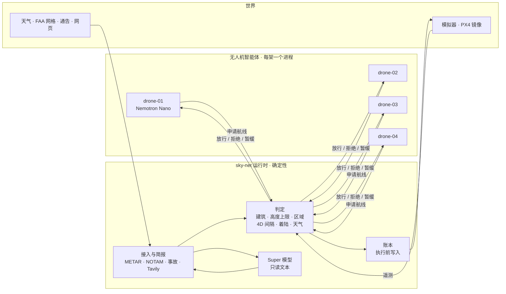

# sky-net

**智能体提出申请，运行时决定放行，只有获准的飞行才会执行。**

[English](README.md) · [한국어](README.kr.md)

- 面向 AI 运营无人机机队的放行运行时。
- 无人机智能体（Nemotron 或规则）只负责提交申请；判定、记录和下达指令都由运行时完成。
- 判定环节不使用模型。收紧的规则立即生效，放宽的规则要等人确认。



## 运行时看到什么

| 输入 | 来源 | 用途 |
|---|---|---|
| 申请：动作、航段、模型记录 | 无人机智能体，`POST /proposals` | 判定并记录，然后执行或拒绝 |
| 遥测：位置、高度、状态、时钟戳 | 航空器适配器，每 0.25 秒 | 航线符合性、提前起飞、失联（15 个时钟周期无新时间戳） |
| 空域：34,581 栋 20 m 及以上建筑、FAA UAS 设施图网格、区域 | `configs/airspace`，首次放行前载入 | 判定 |
| 每条已放行航线 | 各自的 4D 意图 | 间隔、着陆点、起飞柱 |
| 官方信息源：NOTAM、召回、天气、事故 | 模拟器公告（代替官方数据源） | 禁入区、召回、暂停起飞 |
| METAR | aviationweather.gov，每 300 秒 | 超出 `configs/fleet.yaml` 限值时全队暂停起飞 |
| 网页：塔吊、活动、公园关闭、飞行限制 | Tavily；无密钥时使用录制的 fixture | 临时障碍与禁入区，均附来源 URL |
| 手动提交的报告 | `POST /intake` | 经过同样的语法与检查，等人确认后才生效 |
| 人工答复 | 人工审批页 `/approvals.html` | 提前解除规则、待定通告、失联卡片 |
| 智能体注册 | `POST /agents/register` | 地图上的模型标签；不参与判定 |

## 运行时内部

每份申请逐一处理：表单 → 空域 → 4D 意图 → 策略 → 权限 → 账本 → 指令。

| 部件 | 职责 | 代码 |
|---|---|---|
| 判定 | 航线、垂直柱、着陆共用同一项检查：建筑（+50 m）、FAA 高度上限、区域、横向间距 | `shared/geo.py`（`first_breach`） |
| 意图 | 已放行航线存为 4D 空间（30 m、25 m、±30 个周期）；为失联航空器预留空间；监视链路 | `backend/intents.py` |
| 策略、权限 | 召回与天气暂停；始终需要人批准的动作 | `backend/policy.py`、`backend/authority.py` |
| 锁、仲裁 | 每个起降坪只有一个持有者；为争用同一资源的合法申请排序 | `backend/locks.py`、`backend/arbiter.py` |
| 账本 | 只追加，先于指令写入；`GET /ledger/report` 每次飞行一行 | `backend/ledger.py`、`backend/reports/` |
| 执行、适配器 | 通往航空器的唯一路径：模拟器 HTTP、MAVLink（PX4）、PX4 镜像 | `backend/commit.py`、`backend/adapters/` |
| 接入、简报 | 数据源与文本 → 语法 → Super 模型（仅文本）→ 代码检查 → 规则 | `backend/intake.py`、`backend/briefing.py` |
| 通告 | 每条通告关闭什么、从何时起、依据谁的说法 | `backend/notices.py` |
| 建议 | 多次被拒后列出合法选项；Super 模型可以推荐其中一项 | `backend/advisory.py` |
| 存储 | 接入条目与规则落盘（SQLite） | `backend/store.py` |
| 回放 | 用当时尚不存在的规则重跑账本 | `backend/replay.py`、`scripts/what_if.py` |

- 智能体 → 运行时：只有申请。这条链路断开时，航空器不受影响。
- 运行时 → 航空器：指令与遥测。这条链路断开时，航空器飞完已放行航线后着陆，其空间保持预留。
- 模型负责填表、在规划器给出的航线中挑选、阅读并摘要文本，从不参与判定。每份申请都带有
  `params.model_trace`，地图的悬停卡片会显示它。

## 演示

四架无人机从布鲁克林的仓库屋顶出发，把货送到曼哈顿各处的着陆区。一轮 5,000 个周期（约 17 分钟）。空域关闭、
天气暂停、火灾和失联在固定时刻发生，其余情况随交通自然出现。地图把运行时画在下曼哈顿的联邦政府大楼
26 Federal Plaza：放行服务不属于任何一家运营方。

| 场景 | 经过 | 决定方 |
|---|---|---|
| 直线被拒 | 通往送货点的直线穿过建筑，被拒并点名该建筑 | 判定 |
| 选择航线 | 规划器画出最多三条合法候选；无人机上的 Nemotron 用 `choose_route(id, reason)` 选一条 | 模型挑选，判定放行 |
| 飞行中空域关闭 | 第 525 个周期，一条 NOTAM 关闭直升机坪走廊，drone-03 正在其中。它被召回，并在 22 个周期内从最近的出口离开 | 判定，依据解析后的 NOTAM |
| 交叉航迹 | 两条航线在同一时刻相距 30 m、25 m 以内。后申请的一方被拒并点名对方，随后爬升、等待或改报不冲突的候选 | 判定（4D 意图） |
| 天气暂停 | METAR 报阵风 28 kt。一个周期内全队暂停起飞，空中的航空器着陆。提前解除需要人来决定 | 代码对照 `configs/fleet.yaml` |
| 着陆区附近火灾 | 报告给出一个地址。该建筑周围 150 m 设为禁入区，Gantry Plaza 无法使用。种子 7 下没有走廊穿过这里 | 语法或 Super 读取，代码核对地址 |
| 运行时简报 | 每轮开始时以及每进入一个新的约 1 km 网格时，用 Tavily 查询塔吊、活动、关闭和限制。每条规则都注明 URL | 语法读取，代码检查；只有官方页面立即生效 |
| 失联 | 一架航空器失联，它飞完已放行航线后着陆。其走廊保持预留，运行时不再向它发送任何内容，恢复后核对位置 | 判定 |
| 运行时建议 | 同一原因连续被拒三次后，列出合法选项；Super 模型可以推荐其中一项 | 代码生成并检查选项 |
| PX4 镜像（可选） | drone-01 同时由真实 PX4（SIH）飞行。已放行航线变成任务，召回也会传到它 | 运行时；世界状态以模拟器为准 |

地图的演示模式（`?demo=1`）会跟随各个场景，字幕只由账本代码和数值拼成，从不由模型撰写。动一下地图，
它会暂停 20 秒。`./scripts/demo.sh` 会从第 0 个周期以这个模式打开地图。

## 计分板

同样四个智能体，在同一套规则下用两种方式接线：一种经过运行时，另一种直接连到飞控（如今大多数机队的接法）。
种子 7，一轮（`tests/test_two_worlds.py` 中的 `run()`）：

| 计数项 | 运行时 | 直连 |
|---|---|---|
| 空域违规 | 0 | 48 |
| 超出高度上限 | 0 | 13 |
| 无记录动作 | 0 | 36（其全部 36 个动作） |
| 间隔丧失 | 0 | 3 |
| 天气暂停期间起飞 | 0 | 2 |
| 送达 | 21 | 20 |

运行时一侧的其余计数也都是 0：起降坪冲突、闯入区域、超过离开时限仍停留在区域内、着陆点冲突、闯入事故区、
闯入失联预留空间、召回后违规。45 个动作全部有记录。各项的统计方法见
[docs/RULES.md](docs/RULES.md#how-the-scoreboard-counts)。

## 快速开始

### 最低配置

| | 最低要求 | M5 Max 实测 |
|---|---|---|
| Docker | Docker Engine 24+，Compose 2.24+（macOS 与 Windows 用 Docker Desktop） | Engine 29.7，Compose 5.5 |
| 整个栈（仅规则，或使用 Nebius 密钥） | 2 核 CPU，给 Docker 4 GB 内存，2 GB 磁盘 | 7 个容器约占 1.5 GB 内存，CPU 远低于 1 核；镜像约 1 GB |
| 不用密钥、改用本地模型 | Apple Silicon，64 GB 内存 | 5 个 `nemotron-3-nano:4b` 服务，每个约 7.5 GB；只需下载一次，2.8 GB |
| PX4 SITL（可选） | 再加 1 核 CPU、3 GB 磁盘 | SIH 约占半核、10 MiB；镜像 2.95 GB |
| 不用 Docker | Python 3.12 与 `pyyaml`；地图测试需要 Node 22 | |

### 运行

1. 克隆仓库。

   ```sh
   git clone https://github.com/vectordyne-temp/sky-net && cd sky-net
   ```

2. 以示例文件为模板创建 `.env.local`。所有值都是可选的：有 `NEBIUS_API_KEY` 和 `TAVILY_API_KEY` 就填上；
   留空则用规则和录制的简报运行。

   ```sh
   cp .env.local.example .env.local
   ```

3. 启动整个栈。

   ```sh
   docker compose -f docker-compose.local.yml --env-file .env.local up --build
   ```

4. 打开地图：http://localhost:3100。人工审批：http://localhost:3100/approvals.html · 运行时 API：:8000 ·
   模拟器：:8100。

`make up` 一次完成第 2、3 步。共享开发服务器用各自的文件，步骤相同：

```sh
cp .env.dev.example .env.dev
docker compose -f docker-compose.dev.yml --env-file .env.dev up -d --build
```

### 模型如何选择

没有必填项，每种输入各自回退：

| 输入 | 首选 | 其次 | 最后 |
|---|---|---|---|
| 无人机与运行时的模型 | `NEBIUS_API_KEY`：Nebius Token Factory 上的 Nemotron（每架无人机用 Nano，运行时用 Super） | 本地 Ollama：每架无人机一个服务（11435–11438），运行时一个（11439）；都没有则用 Ollama 应用（11434） | 仅规则 |
| 网页简报与检索 | `TAVILY_API_KEY`：实时 Tavily | `tests/fixtures/tavily` 中的录制简报，标注 "recorded" | — |
| 天气 | aviationweather.gov 的 METAR | 模拟天气报告 | — |

- `scripts/dev.sh` 会自行探测本地 Ollama，并打印选择结果。Docker Compose 不探测宿主机：没有密钥时只用规则运行，
  除非 `.env.local` 指向 Mac 上的 Ollama（见 `.env.local.example` 中的 "docker compose" 一段）。
- 仅用规则也能完整跑完一轮：所有场景都会出现，地图在本该由模型填写的地方标注 "rules"。
- 无论模型写了什么，运行时都用同一套规则判定。

### 可选栈

在本地文件之后叠加一个 overlay：
`docker compose -f docker-compose.local.yml -f <overlay> --env-file .env.local up --build`

| Overlay | 增加的内容 |
|---|---|
| `sim/docker-compose.sitl.yml` | 镜像 drone-01 的真实 PX4 飞控（SIH） |
| `drone/docker-compose.direct.yml` | 直连接线：同样四个智能体直接操控飞控（计分板的对照一侧） |

### 不用 Docker

```sh
./scripts/dev.sh      # 自动选择 Nebius、本地 Ollama 或规则
./scripts/demo.sh     # 从第 0 个周期启动干净的种子 7 栈，以演示模式打开地图
./scripts/sitl.sh     # 同一个栈，drone-01 另由 PX4 SIH 飞行（需要 Docker）
make test             # Python 测试；地图测试用 node --test tests/test_map.mjs
```

- Tavily 预算：`TAVILY_BUDGET_PER_ROUND`（每轮默认 20 credits，与检索共用）。重新简报：
  `curl -X POST http://127.0.0.1:8000/briefing/run`。
- 常用设置都在 `.env.local.example` 中有说明。
- 开发环境搭建、提交前要跑的检查和 PR 流程见 [CONTRIBUTING.md](CONTRIBUTING.md)。

## 仓库结构

```
frontend/   地图（MapLibre）与人工审批页：静态文件，由一个禁用缓存的小服务器提供
backend/    运行时：判定、4D 意图、策略、锁、账本、执行、接入、简报、建议
            adapters/：唯一接触航空器的代码（模拟器 HTTP、MAVLink、PX4 镜像）
drone/      agent/：无人机智能体——感知、填表、规划（A* 候选）、选择（Nemotron 工具调用）、提交
            direct/：对照接线——同一个智能体自带执行器客户端
shared/     几何、空域、航线规划器、配置、语法解析器、Tavily 与 METAR 客户端、llm/
sim/        世界：固定种子的模拟器、计分板、规则或 cuOpt 调度
configs/    机队、天气限值、简报、FAA 网格、34,581 栋建筑、地址
scripts/    开发与演示启动脚本、PX4 SITL、本地 Ollama 机队、数据抓取
tests/      Python 测试、地图测试、固定种子的双世界测试台
```

每个栈目录自带 Dockerfile 和可选 overlay；根目录为每个环境各放一个 compose 文件。

## 作者

Changkeun Lee（[@liebertar](https://github.com/liebertar)）与 Dong Jun Kim（[@dejaikeem](https://github.com/dejaikeem)）。
为 Nebius × NVIDIA Global AI Hackathon（Physical AI 赛道）而作。Apache-2.0：[LICENSE](LICENSE)、
[NOTICE](NOTICE)。
