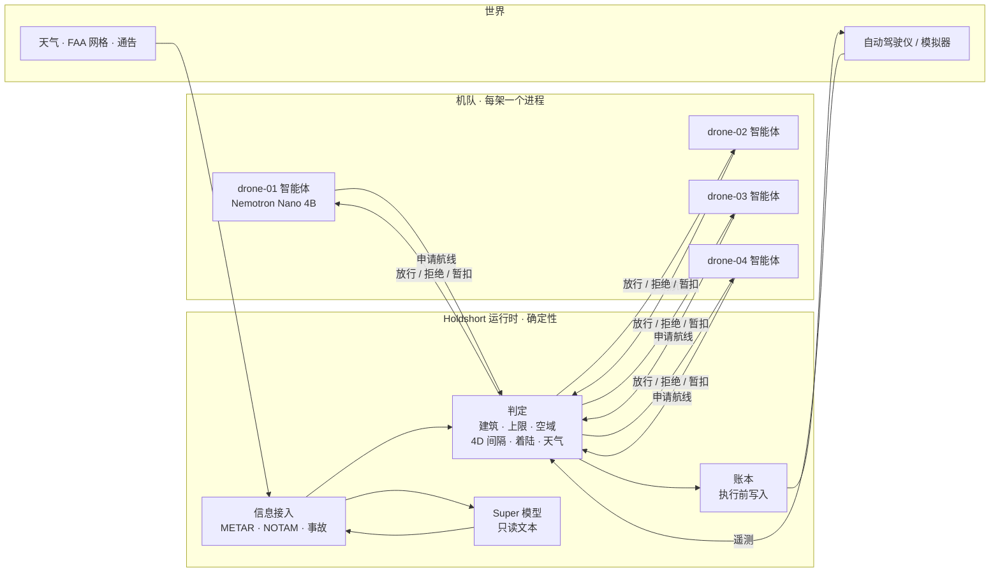

# Holdshort

**智能体提出申请。塔台放行。只有获准的飞行才会移动。**

[English](README.md) · [한국어](README.kr.md)

Holdshort 是面向 AI 运营机队的放行权威运行时。每架无人机都有自己的智能体（小型 Nemotron 模型或纯规则），
决定要做什么并自行绘制航线。在运行时依据物理世界——建筑、高度上限、关闭空域、其他航空器、天气、
事故——完成判定、记录并执行之前，什么都不会起飞。判定路径中没有任何模型。演示用同一随机种子把同一
机队跑两遍：一遍经过运行时，一遍由智能体直接操控自动驾驶仪，并计分对比。



两条链路，两种性质。智能体只与运行时通信，且只用于申请。只有运行时能操控航空器。智能体链路断开，
航空器毫无影响；航空器链路断开，它飞完已获准的航线并在那里着陆，运行时为它保留该空间。

## 演示展示的内容

四架无人机从布鲁克林的仓库屋顶向曼哈顿各处的着陆区送货。一轮 5,000 拍（约 17 分钟），以下场景在固定
种子下按固定时刻发生。

| 场景 | 发生什么 | 谁决定 |
|---|---|---|
| 直线被拒 | 向哈莱姆申请直线，擦到一栋 114 m 建筑。拒绝并点名建筑；智能体重绘；绕行获准 | 判定（代码） |
| 飞行中空域关闭 | 一条 NOTAM 关闭直升机坪走廊。穿过它的已获准航线被撤回，航空器从最近出口离开，新航线被拒 | 由语法解析的 NOTAM 判定 |
| 交叉航迹 | 两条航线会在同一时刻 30 m · 25 m 内相交。后者被拒；运营方爬升 30 m 或等待对方窗口 | 判定（4D 意图） |
| 天气暂停 | METAR 报告阵风 28 节。一拍之内全队暂停起飞；空中航空器继续并着陆。提前解除需要人 | 代码与 `configs/fleet.yaml` 限值比较 |
| 着陆区附近火灾 | 文本报告给出地址。该建筑周围出现 150 m 禁区；穿过它的走廊被撤回 | 语法或 Super 模型读文本；代码核实地址并施加规则 |
| 链路丢失 | 一架航空器失联。它飞完已获准航线并着陆；其他航空器在其到期前不得进入其保留空间 | 判定；不向失联航空器发送任何指令 |
| 塔台建议 | 同一原因被拒三次后，运行时列出合法选项，Super 模型可推荐一项。不执行任何动作 | 代码生成并检查选项 |

地图旁的计分板统计两种接线的空域违规、上限突破、间隔丢失、暂停期间起飞、闯入事故区和无记录动作。
运行时一列保持为零；直连一列则不然。

## 运行

```sh
git clone https://github.com/liebertar/holdshort && cd holdshort
docker compose up --build          # http://localhost:3100  （仅规则，无需密钥）
```

不用 Docker：`./scripts/dev.sh`（只需 Python 3.12 和 `pyyaml`）。地图是 `ui/map.html`，管制员审批箱是
`ui/index.html`。

模型和数据源有凭据即启用、无凭据即关闭，其他一切不变。

| 设置 | 存在时 | 缺失时 |
|---|---|---|
| `NEBIUS_API_KEY` | Nebius Token Factory 上的 Nemotron（每架 Nano，塔台 Super） | 本地 Ollama 机队若可用则用之，否则仅规则 |
| `TAVILY_API_KEY` | 实时检索限飞与事故，施加前须人工确认 | 同一时刻表的模拟通告 |
| 网络 | aviationweather.gov 的 METAR，立即施加 | 模拟天气报告 |

`scripts/ollama_fleet.sh start 4` 为每架无人机启动一个本地 `nemotron-3-nano:4b`；塔台在本地用同一模型、
在 Nebius 上用 Nemotron 3 Super 120B 读取文本。

## 如何判定

- 只有一个判定函数 `first_breach`，用于所有航线、垂直柱和着陆：20 m 以上建筑上方留 50 m 净空（仅在 200 ft
  FAA 网格下且屋顶低于 40 m 时为 20 m），距建筑 10 m，距关闭网格与空域 40 m，巡航 70–120 m（网格上限更低时
  以其为准）。
- 获准航线成为 4D 意图：横向 30 m，垂直 25 m，前后各 30 拍，外加起降柱与失联应急体。新申请与所有活动意图核对。
- 收紧的规则到达即生效；放宽的规则等待人工或到期。
- 触碰执行器之前先写账本：拍数、空域版本、执行的检查、申请作者。`GET /ledger/report` 把它折叠为每次飞行一行。
- 模型负责写申请表、起草航线、读文本、写摘要。它们返回的一切都经过同一判定。地图上每条走廊都标注绘制者：
  `A*`、`nano` 或 `straight`。

详情：[ARCHITECTURE.md](ARCHITECTURE.md) · [docs/RULES.md](docs/RULES.md) · [docs/MODELS.md](docs/MODELS.md) ·
[docs/DECISIONS.md](docs/DECISIONS.md) · [docs/DEMO.md](docs/DEMO.md)

## 定位

ASTM F3269 描述运行时保证：由经验证的监视器约束未经验证的复杂功能。Holdshort 就是调度层上的这个监视器，
复杂功能则是 LLM 智能体。ASTM F3548 描述空域服务之间的 4D 运行意图；Holdshort 的意图形状相同。两项标准都
未规定智能体如何向权威提交意图、如何记录来源。本仓库提出的正是这一接口，并附参考实现与双世界一致性测试。

## 仓库

```
holdshort/agent      运营方智能体：感知、申请表、起草、规划（A*）、提交
holdshort/runtime    判定、意图、账本、执行、信息接入、建议、通告
holdshort/core       几何、空域、航线规划器、配置、语法解析器
holdshort/llm        OpenAI 兼容客户端，分层与录制
sim/                 世界：两种接线，一个种子，计分板
direct_agent/        无守护接线——同一智能体代码，自带执行器
ui/                  地图（MapLibre）与审批箱，静态文件
configs/             机队、天气限值、FAA 网格、34,581 栋建筑、地址
tests/               Python 339 项，地图 41 项，种子双世界测试台
```

为 Nebius × NVIDIA Global AI Hackathon（Physical AI 赛道）构建。许可证：[LICENSE](LICENSE)。
