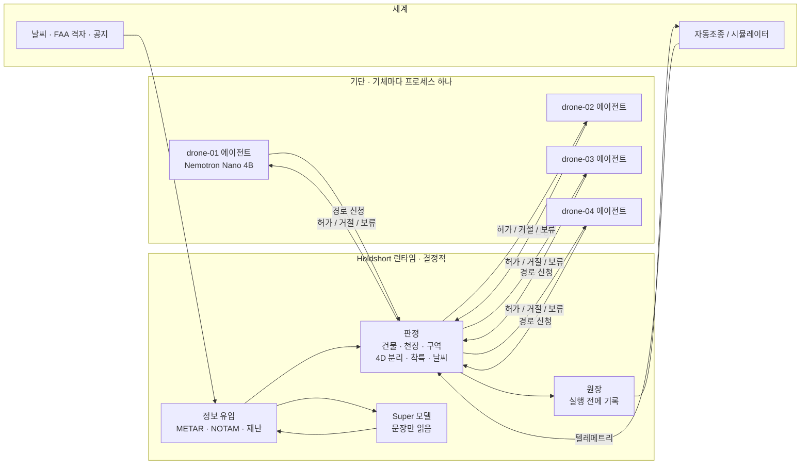

# Holdshort

**에이전트는 신청한다. 관제가 허가한다. 허가된 비행만 움직인다.**

[English](README.md) · [中文](README.cn.md)

Holdshort는 AI가 운항하는 기단을 위한 관제 승인 런타임입니다. 드론마다 자기 에이전트(작은 Nemotron 모델
또는 규칙)가 있어 무엇을 할지 정하고 경로를 스스로 그립니다. 그 신청을 런타임이 물리 세계에 대고 판정해서
— 건물, 고도 천장, 닫힌 공역, 다른 기체, 날씨, 재난 — 기록하고 실행하기 전까지는 아무것도 날지 않습니다.
판정 경로에는 모델이 없습니다. 데모는 같은 기단을 같은 씨앗으로 두 번 돌립니다. 한 번은 런타임을 거쳐서,
한 번은 에이전트가 자동조종을 직접 만지며. 점수판이 그 차이를 셉니다.



링크는 둘이고 성격이 다릅니다. 에이전트는 런타임하고만, 그것도 신청만 합니다. 기체를 만지는 것은 런타임뿐입니다.
에이전트 링크가 끊겨도 기체는 아무 영향이 없습니다. 기체 링크가 끊기면 허가받은 경로를 마저 가서 거기 내리고,
런타임은 그 공간을 남에게 내주지 않습니다.

## 데모가 보여주는 것

드론 넷이 브루클린의 창고 옥상에서 맨해튼 곳곳의 착륙장으로 배달합니다. 한 판은 5,000틱(약 17분)이고,
아래 장면은 고정 씨앗으로 정해진 시각에 일어납니다.

| 장면 | 무슨 일 | 누가 정하나 |
|---|---|---|
| 직선 거절 | 할렘까지 직선을 냈더니 114 m 건물에 걸림. 건물 이름과 함께 거절, 에이전트가 다시 그림, 우회로 허가 | 판정(코드) |
| 나는 중 공역 폐쇄 | NOTAM이 헬리패드 회랑을 닫음. 지나던 허가 경로는 회수돼 가장 가까운 출구로, 새 경로는 거절 | 문법이 읽은 NOTAM으로 판정 |
| 교차 | 두 경로가 같은 시각 30 m·25 m 안에서 겹침. 뒤 것이 거절되고 운영사가 30 m 올리거나 앞 기체의 창이 지나길 기다림 | 판정(4D 의도) |
| 기상 보류 | METAR에 돌풍 28 kt. 한 틱 안에 기단 전체 이륙 보류, 나는 기체는 계속 가서 내림. 일찍 푸는 건 사람 | 코드가 `configs/fleet.yaml` 한도와 비교 |
| 착륙장 옆 화재 | 문장으로 온 보고에 주소가 있음. 그 건물 둘레 150 m 금지 구역, 지나던 회랑 회수 | 문법 또는 Super 모델이 읽고, 코드가 주소를 확인해 규칙 적용 |
| 링크 끊김 | 기체 하나가 조용해짐. 허가된 경로를 마저 가서 내리고, 그동안 남은 그 공간으로 못 들어감 | 판정. 끊긴 기체에는 아무 명령도 안 감 |
| 관제 권고 | 같은 이유로 세 번 거절되면 런타임이 합법 선택지를 나열, Super 모델이 하나를 추천할 수 있음. 실행은 안 함 | 코드가 선택지를 만들고 검사 |

지도 옆 점수판은 두 배선 모두의 공역 위반, 천장 초과, 분리 상실, 보류 중 이륙, 재난 구역 진입, 기록 없는
실행을 셉니다. 런타임 열은 0에 머물고 직결 열은 그렇지 않습니다.

## 돌리기

```sh
git clone https://github.com/liebertar/holdshort && cd holdshort
docker compose up --build          # http://localhost:3100  (규칙만, 키 필요 없음)
```

Docker 없이: `./scripts/dev.sh` (Python 3.12과 `pyyaml`뿐). 지도는 `ui/map.html`, 관제사 승인함은 `ui/index.html`.

모델과 정보 원천은 자격이 있으면 켜지고 없으면 꺼집니다. 그 외에는 아무것도 달라지지 않습니다.

| 설정 | 있을 때 | 없을 때 |
|---|---|---|
| `NEBIUS_API_KEY` | Nebius Token Factory의 Nemotron(기체마다 Nano, 관제에 Super) | 로컬 Ollama 함대가 답하면 그것, 아니면 규칙만 |
| `TAVILY_API_KEY` | 비행제한·재난 실시간 검색, 적용 전 사람 확인 | 같은 시각의 시뮬레이터 공지 |
| 네트워크 | aviationweather.gov METAR, 즉시 적용 | 시뮬레이터 기상 보고 |

`scripts/ollama_fleet.sh start 4`는 드론마다 로컬 `nemotron-3-nano:4b` 서버를 하나씩 줍니다. 관제는 로컬에서는
같은 모델로, Nebius에서는 Nemotron 3 Super 120B로 문장을 읽습니다.

## 어떻게 판정하나

- 판정 함수는 하나, `first_breach`. 모든 경로·승강 기둥·착륙에 같은 함수. 20 m 이상 건물 위 50 m 이격
  (200 ft FAA 칸 아래의 낮은 지붕만 20 m), 건물 옆 10 m, 닫힌 칸·구역 옆 40 m, 순항 70~120 m(칸 천장이
  낮으면 그 아래).
- 허가된 경로는 4D 의도가 됩니다. 수평 30 m, 수직 25 m, 앞뒤 30틱, 여기에 이륙·착륙 기둥과 링크 끊김 비상
  볼륨까지. 새 신청은 살아 있는 모든 의도와 대조합니다.
- 조이는 규칙은 도착한 순간 적용. 푸는 규칙은 사람 또는 만료를 기다림.
- 원장 한 줄을 조종장치를 만지기 전에 씁니다. 틱, 공역 판본, 돌린 검사, 신청서를 쓴 주체. `GET /ledger/report`가
  비행 하나당 한 줄로 접어 줍니다.
- 모델은 신청서를 쓰고, 경로 초안을 그리고, 문장을 읽고, 요약합니다. 돌려준 것은 전부 같은 판정을 거칩니다.
  지도의 모든 회랑에 누가 그렸는지 적혀 있습니다: `A*`, `nano`, `straight`.

자세히: [ARCHITECTURE.md](ARCHITECTURE.md) · [docs/RULES.md](docs/RULES.md) · [docs/MODELS.md](docs/MODELS.md) ·
[docs/DECISIONS.md](docs/DECISIONS.md) · [docs/DEMO.md](docs/DEMO.md)

## 어디에 놓이나

ASTM F3269는 검증된 감시기가 검증되지 않은 복잡한 기능을 묶는 런타임 보증을 다룹니다. Holdshort는 그 감시기를
배차 층에 둔 것이고, 복잡한 기능이 LLM 에이전트입니다. ASTM F3548은 공역 서비스 사이의 4D 운항 의도를 다루며
Holdshort의 의도는 같은 모양입니다. 두 표준 모두 에이전트가 권위에 의도를 신청하는 방법과 출처를 기록하는 방법은
정하지 않았습니다. 이 저장소가 제안하는 것이 그 인터페이스이고, 참조 구현과 두 세계 적합성 시험이 붙어 있습니다.

## 저장소

```
holdshort/agent      운영사 에이전트: 감지, 신청서, 초안, 계획(A*), 신청
holdshort/runtime    판정, 의도, 원장, 실행, 정보 유입, 권고, 공지
holdshort/core       기하, 공역, 경로 계획기, 설정, 문법 판독기
holdshort/llm        OpenAI 호환 클라이언트, 티어와 녹음
sim/                 세계: 두 배선, 한 씨앗, 점수판
direct_agent/        가드 없는 배선 — 같은 에이전트 코드, 자기 조종장치
ui/                  지도(MapLibre)와 승인함, 정적 파일
configs/             기단, 기상 한도, FAA 격자, 건물 34,581동, 주소
tests/               파이썬 339, 지도 41, 씨앗 두 세계 하네스
```

Nebius × NVIDIA Global AI Hackathon, Physical AI 트랙 출품작. 라이선스: [LICENSE](LICENSE).
