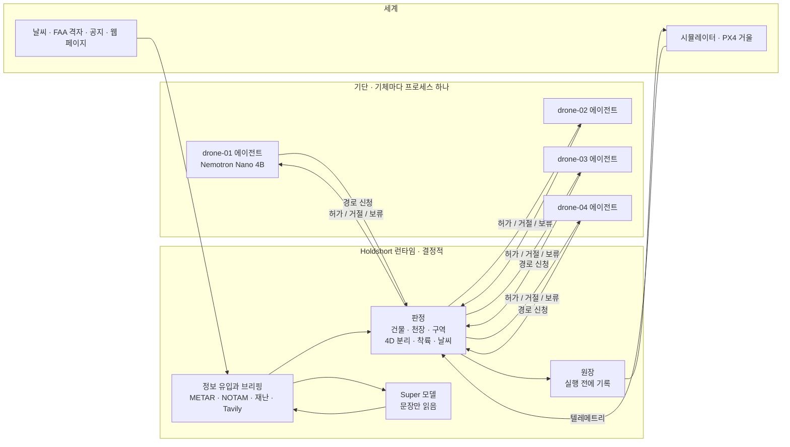

# Holdshort

**에이전트는 신청한다. 관제가 허가한다. 허가된 비행만 움직인다.**

[English](README.md) · [中文](README.cn.md)

Holdshort는 AI가 운항하는 기단을 위한 관제 승인 런타임입니다. 드론마다 자기 에이전트(작은 Nemotron 모델
또는 규칙)가 있어 무엇을 할지, 어떤 경로를 신청할지 정합니다. 그 신청을 런타임이 물리 세계에 대고 판정해서
— 건물, 고도 천장, 닫힌 공역, 다른 기체, 날씨, 재난 — 기록하고 실행하기 전까지는 아무것도 날지 않습니다.
판정 경로에는 모델이 없습니다. 데모는 같은 기단을 같은 씨앗으로 두 번 돌립니다. 한 번은 런타임을 거쳐서,
한 번은 에이전트가 자동조종에 직접 명령하게 해서. 점수판이 그 차이를 셉니다.



링크는 둘이고 성격이 다릅니다. 에이전트는 런타임하고만, 그것도 신청만 합니다. 기체를 만지는 것은 런타임뿐입니다.
에이전트 링크가 끊겨도 기체는 아무 영향이 없습니다. 기체 링크가 끊기면 허가받은 경로를 마저 가서 거기 내리고,
런타임은 그 공간을 남에게 내주지 않습니다.

## 데모가 보여주는 것

드론 넷이 브루클린의 창고 옥상에서 맨해튼 곳곳의 착륙장으로 배달합니다. 한 판은 5,000틱(약 17분)입니다.
공역 폐쇄, 기상 보류, 화재, 링크 끊김은 고정 씨앗으로 정해진 틱에 일어나고, 나머지 장면은 교통에 따라 일어납니다.
PX4 줄은 선택입니다.

| 장면 | 무슨 일 | 누가 정하나 |
|---|---|---|
| 직선 거절 | 드론이 목적지까지 직선을 냈더니 건물을 가로지름. 건물 이름과 함께 거절 | 판정(코드) |
| 경로 고르기 | 운영사 계획기가 규정 안의 후보를 셋까지 그림: 최단, 가장 낮은 고도, 다른 기체와 금지 구역에서 떨어진 길. 드론 자신의 Nemotron이 `choose_route(id, reason)`을 불러 하나를 고름. 고른 경로는 런타임이 다른 신청과 똑같이 판정 | 고르는 것은 모델, 허가·거절은 판정 |
| 관제 브리핑 | 판이 시작할 때, 그리고 새로 허가된 회랑이 이번 판에 아무도 묻지 않은 약 1 km 칸에 들어설 때마다 관제가 Tavily에 그 장소와 그날을 물음: 타워크레인, 행사, 공원 폐쇄, 비행 제한, 기상 특보. 여기서 만든 규칙은 모두 출처 URL을 달고 있음 | 문법이 읽고 코드가 검사. 문법이 읽은 공식 페이지는 바로 적용, 나머지는 사람을 기다림 |
| 나는 중 공역 폐쇄 | 틱 525에 NOTAM이 헬리패드 회랑을 닫음. drone-03이 그 안에 있음. 경로가 회수되고 22틱 이탈 허용 시간 안에 가장 가까운 출구로 빠져나감. 그 구역을 지나는 새 경로는 거절 | 문법이 읽은 NOTAM으로 판정 |
| 교차 | 두 경로가 같은 시각 30 m·25 m 안으로 지나게 됨. 뒤 것이 상대 기체 이름과 함께 거절되고, 그 운영사는 30 m 올리거나, 앞 기체의 창이 지나길 기다리거나, 비켜 가는 후보를 신청 | 판정(4D 의도) |
| 기상 보류 | METAR에 돌풍 28 kt. 한 틱 안에 기단 전체 이륙 보류, 나는 기체는 계속 가서 내림. 일찍 푸는 건 사람 | 코드가 `configs/fleet.yaml` 한도와 비교 |
| 착륙장 옆 화재 | 보고에 주소가 있음. 그 건물 둘레에 150 m 금지 구역이 생기고, 원 둘레 50 m 안에 드는 Gantry Plaza 착륙장은 쓸 수 없음. 씨앗 7에서는 이 원을 가로지르는 허가 회랑이 없고, 원이 있는 동안 허가된 경로는 모두 원을 비켜 감 | 문법 또는 Super 모델이 읽고, 코드가 주소를 확인해 규칙 적용 |
| 링크 끊김 | 기체 하나가 조용해짐. 허가된 경로를 마저 가서 내림. 런타임은 남은 회랑을 예정 시각까지 잡아 두고 그 기체에 아무것도 보내지 않음. 다시 들리면 위치를 허가한 것과 대조 | 판정. 끊긴 기체에는 아무 명령도 안 감 |
| 관제 권고 | 같은 이유로 세 번 거절되면 런타임이 합법 선택지를 나열, Super 모델이 하나를 추천할 수 있음. 실행은 안 함 | 코드가 선택지를 만들고 검사 |
| PX4 거울(선택) | `ADAPTER=composite`이면 런타임 쪽 기체 한 대를 진짜 PX4 자동조종(SIH 모드)도 같이 몲. 허가된 경로는 PX4 임무가 되고, 회수는 자동조종까지 가고, 거절된 신청은 아무것도 보내지 않음 | 명령은 런타임. 기준이 되는 세계는 여전히 시뮬레이터 |

지도 옆 점수판은 두 배선을 같은 규칙으로 셉니다. 씨앗 7, 5,000틱 한 판, 기본 배선
(`tests/test_two_worlds.py`의 `run()`) 결과입니다:

| 항목 | 런타임 | 직결 |
|---|---|---|
| 공역 위반 | 0 | 48 |
| 천장 초과 | 0 | 13 |
| 기록 없는 실행 | 0 | 36 (실행 36건 전부) |
| 분리 상실 | 0 | 3 |
| 기상 보류 중 이륙 | 0 | 2 |
| 배달 | 21 | 20 |

런타임 쪽의 나머지 위반 항목도 모두 0입니다: 착륙대 충돌, 구역 침범, 나갈 시간을 넘긴 구역 체류, 지상 기체와의
근접, 재난 구역 침범, 링크 끊김 공간 침범, 회수 뒤 위반. 실행은 45건이고 전부 기록됐습니다. 항목마다 어떻게
세는지는 [docs/RULES.md](docs/RULES.md#how-the-scoreboard-counts)에 있습니다.

## 돌리기

```sh
git clone https://github.com/liebertar/holdshort && cd holdshort
docker compose up --build          # 규칙만, 키 필요 없음
```

지도는 http://localhost:3100/map.html, 관제사 승인함은 http://localhost:3100 입니다.

키가 있으면 예시 파일을 복사해 가진 것만 채웁니다:

```sh
cp .env.example .env.local         # NEBIUS_API_KEY, TAVILY_API_KEY
docker compose --env-file .env.local up --build
```

Docker 없이(Python 3.12과 `pyyaml`):

```sh
./scripts/dev.sh      # Nebius, 로컬 Ollama, 규칙 중에서 스스로 고름. 지도는 http://127.0.0.1:3100/map.html
./scripts/demo.sh     # 포트를 쥔 것을 내리고, 깨끗한 씨앗 7 스택을 틱 0부터 올린 뒤 map.html?demo=1 을 엶
```

`./scripts/sitl.sh`는 같은 스택에서 drone-01을 PX4(SIH)로도 같이 몹니다. PX4 컨테이너 때문에 Docker가 필요하고,
`python3`가 `pymavlink`를 불러오지 못하면 첫 실행 때 pip로 `pymavlink`와 `pyyaml`을 `.run/sitl-venv`에 설치합니다.
`docker compose -f compose.yaml -f compose.sitl.yaml up --build`는 PX4 경로를 전부 컨테이너로 돌립니다.

모델과 정보 원천은 자격이 있으면 켜지고 없으면 꺼집니다. 그 외에는 아무것도 달라지지 않습니다.

| 설정 | 있을 때 | 없을 때 |
|---|---|---|
| `NEBIUS_API_KEY` | Nebius Token Factory의 Nemotron(기체마다 Nano, 관제에 Super) | 로컬 Ollama 함대가 답하면 그것(드론은 11435–11438, 관제는 11439, 없으면 11434), 아니면 11434의 Ollama 하나를 모두가, 그것도 없으면 규칙만 |
| `TAVILY_API_KEY` | 실시간 사전 비행 브리핑과 주기 검색 | `tests/fixtures/tavily`의 녹음 브리핑, "recorded" 표시. 같은 시각의 시뮬레이터 공지 |
| 네트워크 | aviationweather.gov METAR, 즉시 적용 | 시뮬레이터 기상 보고 |

`scripts/ollama_fleet.sh start 4`는 드론마다 로컬 `nemotron-3-nano:4b` 서버를 하나씩(11435–11438) 주고,
런타임이 Nemotron 3 Super 대신 쓰는 관제 서버(11439, 문맥 8k)도 띄웁니다. `./scripts/dev.sh`는 플래그 없이
이것들을 찾습니다. Nebius 키가 있으면 로컬 모델은 필요 없습니다.

Tavily 키가 있으면 브리핑이 실시간이 됩니다. 없으면 관제는 Tavily 응답 모양으로 손으로 쓴 fixture를 다시 틀고,
지도·원장·정보 유입 기록에 모두 "recorded"라고 적힙니다. 키가 있으면 비행하는 그날을 두고 search, extract,
crawl, research를 씁니다. 문법이 읽은 공식 도메인의 페이지는 바로 적용되고, 나머지는 Tavily research가 구조화한
답까지 포함해 전부 사람을 기다립니다. `TAVILY_BUDGET_PER_ROUND`(기본 20 크레딧)는 주기 검색과 나눠 쓰고, 판
시작 한 번에 약 16이 듭니다. 다시 물으려면 `curl -X POST http://127.0.0.1:8000/briefing/run`.

## 어떻게 판정하나

- 판정 함수는 하나, `first_breach`. 모든 경로·승강 기둥·착륙에 같은 함수. 20 m 이상 건물 위 50 m 이격
  (200 ft FAA 칸 아래의 낮은 지붕만 20 m), 건물 옆 10 m, 닫힌 칸·구역 옆 40 m, 순항 70~120 m(칸 천장이
  낮으면 그 아래).
- 허가된 경로는 4D 의도가 됩니다. 수평 30 m, 수직 25 m, 앞뒤 30틱, 여기에 이륙·착륙 기둥과 링크 끊김 비상
  볼륨까지. 새 신청은 살아 있는 모든 의도와 대조하고, 한 번에 하나씩 합니다. 판정부터 의도 등록까지를 잠금
  하나가 덮습니다.
- 조이는 규칙은 도착한 순간 적용. 푸는 규칙은 사람 또는 만료를 기다림.
- 원장 한 줄을 조종장치를 만지기 전에 씁니다. 틱, 공역 판본, 돌린 검사, 신청서를 쓴 주체. `GET /ledger/report`가
  비행 하나당 한 줄로 접어 줍니다.
- 모델은 신청서를 쓰고, 운영사 계획기가 그린 경로 중에서 고르고, 문장을 읽고, 요약합니다. 모델이 경유점을 직접
  그리는 것은 후보가 모두 거절된 뒤의 마지막 수단입니다. 모델이 돌려준 것은 무엇이든 같은 판정을 거칩니다.
- 모든 신청에 `params.model_trace`가 실립니다. 신청서를 누가 썼는지(모델, 또는 규칙과 그 이유), 경로가 어디서
  왔는지(직선, 모델의 선택, 모델 초안, A*), 후보와 이유. 런타임은 이것을 읽지 않고, 지도의 호버 카드가 평범한
  말로 보여 줍니다.
- 기체 아래 라벨은 그 기체의 신청서와 경로 선택을 모델이 쓰는 동안 모델 이름을 보여 줍니다. 마지막 등록(30초마다)
  이후 물은 것이 전부 규칙으로 넘어갔으면 `rules`라고 적힙니다.

자세히: [ARCHITECTURE.md](ARCHITECTURE.md) · [docs/RULES.md](docs/RULES.md) · [docs/MODELS.md](docs/MODELS.md) ·
[docs/DECISIONS.md](docs/DECISIONS.md) · [docs/DEMO.md](docs/DEMO.md)

## 어디에 놓이나

ASTM F3269는 검증된 감시기가 검증되지 않은 복잡한 기능을 묶는 런타임 보증을 다룹니다. Holdshort는 그 감시기를
배차 층에 둔 것이고, 복잡한 기능이 LLM 에이전트입니다. ASTM F3548은 공역 서비스 사이의 4D 운항 의도를 다루며
Holdshort의 의도는 같은 모양입니다. 두 표준 모두 에이전트가 권위에 의도를 신청하는 방법과 출처를 기록하는 방법은
정하지 않았습니다. 이 저장소가 제안하는 것이 그 인터페이스이고, 참조 구현과 두 세계 적합성 시험이 붙어 있습니다.

## 저장소

```
holdshort/agent      운영사 에이전트: 감지, 신청서, 계획(A* 후보), 고르기(Nemotron 도구 호출), 초안, 신청
holdshort/runtime    판정, 의도, 원장, 실행, 정보 유입, 브리핑, 권고, 공지
holdshort/core       기하, 공역, 경로 계획기, 설정, 문법 판독기, Tavily·METAR 클라이언트
holdshort/adapters   기체를 만지는 유일한 코드: 시뮬레이터 HTTP, MAVLink(PX4), Flockwave, composite
holdshort/llm        OpenAI 호환 클라이언트, 티어·도구 호출·녹음
sim/                 세계: 두 배선, 한 씨앗, 점수판, 규칙 또는 cuOpt 배차
direct_agent/        가드 없는 배선 — 같은 에이전트 코드, 자기 조종장치
ui/                  지도(MapLibre)와 승인함, 정적 파일
configs/             기단, 기상 한도, 브리핑, FAA 격자, 건물 34,581동, 주소
tests/               파이썬 테스트 542(pymavlink 없으면 27 건너뜀), 지도 테스트 73, 씨앗 두 세계 하네스
```

Nebius × NVIDIA Global AI Hackathon, Physical AI 트랙 출품작. 라이선스: [LICENSE](LICENSE).
