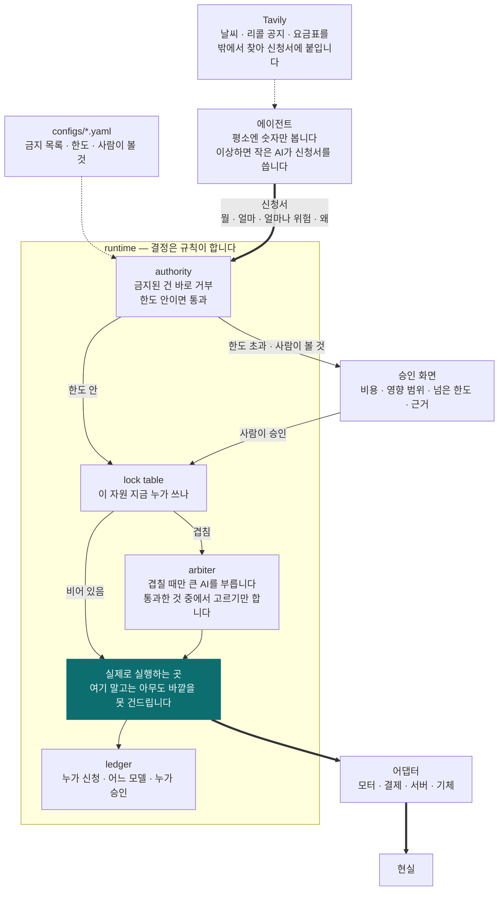
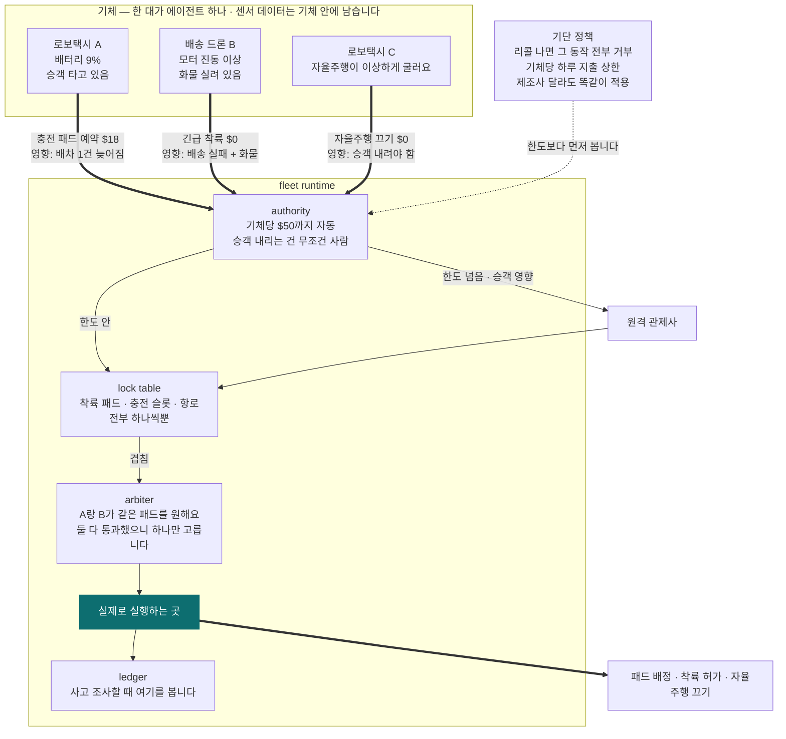

# Attaché

**에이전트는 신청만 합니다. 실행은 런타임만 합니다.**
**AI는 결정권자가 아닙니다. 비행기 세계의 규칙이 이미 그렇게 정해놨습니다.**

---

## 무슨 문제를 푸나요

공장에 AI 에이전트 셋이 돌고 있다고 해봅시다.

- 안전 담당: "진동이 이상해요. 기계 멈춥시다"
- 운영 담당: "지금 멈추면 납기 놓쳐요. 계속 돌립시다"
- 정비 담당: "부품 34만원어치 주문할게요"

셋 다 틀린 말이 아닙니다. 그럼 **누가 결정하나요?**

지금은 정하는 사람이 없습니다. 그래서 회사들이 AI한테 실제 권한을 안 줍니다. 사람이 하나하나
확인하고 넘어갑니다. AI를 붙여놨는데 결국 사람이 다 들여다보고 있으면 붙인 보람이 없죠.

## 어떻게 푸나요

**법인카드랑 똑같이 합니다.**

직원이 회사 통장에서 직접 돈을 빼지는 않습니다. 결제를 *신청*합니다. 한도 안이면 그냥 통과되고,
넘으면 팀장이 봅니다. 누가 신청했고 누가 승인했는지는 기록으로 남고요.

Attaché는 AI 에이전트한테 이 구조를 그대로 씌운 겁니다.
(런타임이라고 부르는 건 그냥 **계속 켜져 있는 프로그램 하나**입니다. 켜두면 안 꺼지고 계속 돕니다.)

- 에이전트는 **행동을 못 합니다.** "이거 하고 싶어요"라고 신청서만 낼 수 있습니다
- 신청서에는 **얼마 드는지, 잘못되면 어디까지 영향이 가는지**를 같이 적습니다
- 런타임이 금지 목록과 한도를 보고 자동으로 통과시키거나, 사람을 부릅니다
- 에이전트 둘이 같은 걸 원하면 런타임이 골라줍니다
- 기계를 실제로 멈추거나 돈을 실제로 쓰는 코드는 **런타임 안에 딱 하나** 있습니다

마지막 줄이 제일 중요합니다. 모터를 끄는 코드, 결제를 보내는 코드는 런타임 안에만 있습니다.
에이전트 쪽에는 그런 코드가 아예 없어요. 그래서 에이전트가 아무리 이상하게 굴어도
신청서를 이상하게 쓸 수 있을 뿐, 직접 뭘 해버릴 수가 없습니다.

## 왜 AI는 결정권자가 될 수 없나요

AI는 같은 질문에 어제와 오늘 다르게 답할 수 있습니다. 그래서 **"이 AI는 절대 실수 안 합니다"라고
보증해줄 방법이 없습니다.** 보증이 안 되는 걸 진짜 기계나 진짜 돈에 연결하려면 방법은 하나뿐입니다.

AI 머릿속을 통제하려고 애쓰지 말고, **AI가 실제로 할 수 있는 행동에만 울타리를 치는 겁니다.**

이건 우리가 지어낸 말이 아닙니다. **비행기 세계는 이미 이렇게 합니다.**

- 유럽 항공청(EASA)의 AI 기준안은 AI를 **목숨이 걸린 최고 안전등급 기능의 결정권자로 두지 않습니다.**
  AI는 도와줄 수 있고, 같이 일할 수 있지만, 마지막 결정은 검증된 프로그램이나 사람이 합니다
- 미국 표준 ASTM F3269는 이렇게 말합니다. **"믿을 수 없는 프로그램은 믿을 수 있는 감시기로
  감싸라. 감시기가 선을 넘는 걸 잡으면 검증된 쪽이 대신 움직인다."** 이걸 런타임 보증이라고 부릅니다

그러니까 "에이전트는 신청만, 실행은 런타임만"은 새로운 발상이 아니라, **비행기가 이미 지키는 규칙을
그대로 가져온 것**입니다.

### 그런데 울타리가 비행기 몸에만 쳐져 있습니다

위 규칙들은 전부 **기체가 어떻게 움직이느냐**만 봅니다. 조종면, 충돌 회피, 하늘길 나누기.
그 위에서 벌어지는 결정에는 울타리가 없습니다.

| 이미 있는 것 | 하는 일 | 안 하는 것 |
|---|---|---|
| 비행 조종 소프트웨어 기준 (DO-178C) | 조종 코드가 틀리지 않게 만듭니다 | AI가 아예 못 들어갑니다 |
| 런타임 보증 (ASTM F3269) | 믿을 수 없는 함수를 감시기로 감쌉니다 | 기체 한 대의 비행 동작만 봅니다 |
| 하늘길 관제 (UTM, ASTM F3548) | 여러 회사 기체가 안 부딪히게 하늘을 나눕니다 | 땅 위 착륙 패드, 충전기, 돈은 안 봅니다 |
| AI 인증 틀 (EASA, ED-324) | AI를 어느 등급까지 쓸지 정합니다 | "결정은 AI가 하지 마라"까지만 말합니다 |
| 사고 보고 (FAA Part 108안) | 사고 나면 운영 회사가 보고합니다 | AI가 뭘 신청했고 누가 승인했는지 적는 형식이 없습니다 |
| 에이전트 도구들 (MCP, NeMo Guardrails, Relay …) | 호출 하나를 연결하고, 막고, 추적합니다 | 신청 셋 중에 뭘 고를지는 모릅니다 |

가드레일은 *나쁜* 요청을 막습니다. Attaché는 *다 괜찮아 보이는* 요청 중에서 하나를 고릅니다.
비슷해 보이지만 완전히 다른 일입니다.

### 우리가 파는 자리 다섯

1. **땅 위 자원.** 착륙 패드, 충전 슬롯, 배터리 교환소. 하늘길은 표준이 있는데 땅은 없습니다
2. **돈.** 기체가 충전료, 착륙료, 견인비를 얼마까지 사람 없이 써도 되는지. 아무 표준도 안 정합니다
3. **리콜.** "지금부터 이 기종의 이 동작은 전부 금지"를 회사가 달라도 한 번에 거는 것
4. **기록.** AI가 뭘 신청했고, 어느 모델이 썼고, 어느 한도를 통과했고, 누가 승인했는지.
   사고 보고서에 그대로 들어가는 형식으로
5. **사람이 볼 것 표시.** "승객 내리는 건 무조건 사람"처럼 행동마다 사람이 끼는지 아닌지를
   설정 파일에 적어두는 것. EASA가 말하는 사람-AI 협업 등급을 기계가 읽게 적은 셈입니다

Wing이나 Zipline처럼 한 회사가 기체부터 소프트웨어까지 다 만들면 자기 시스템이 있습니다.
문제는 **여러 회사 게 한 도시에 섞였을 때**입니다. 그때 공통으로 규칙을 걸 자리가 없습니다.
Attaché는 그 자리에 깔립니다.

---

## 구조



순서가 중요합니다. **한도 검사가 먼저고, AI 중재는 나중입니다.** 중재자(큰 AI)는 이미 한도를
통과한 신청서 중에서 하나를 고를 뿐, 새 행동을 만들어낼 수 없습니다. 목록에 없는 답을 내면 버리고
규칙대로 정하거나 사람을 부릅니다. 이래야 F3269가 말하는 "감시기가 마지막"이 지켜집니다.

모터를 실제로 끄는 코드는 런타임 안에 딱 한 군데 있습니다. 에이전트는 그 코드를 부를 수 없어요.
부를 수 있는 건 런타임뿐입니다. 그림에서 화살표가 전부 한 군데로 모이는 게 그 뜻입니다.

| 어디 | 하는 일 |
|---|---|
| `attache/runtime` | 금지 목록 보고, 한도 보고, 자원 잠그고, 겹치면 골라주고, 실행하고, 기록합니다 |
| `attache/agent` | 감시하고 신청합니다. 실행 코드가 이 안에 없습니다 |
| `attache/adapters` | 현실을 건드리는 유일한 코드. `runtime/commit.py` 만 부릅니다 |
| `attache/llm` | 세 티어 모델 클라이언트. 양식에 안 맞는 답은 버립니다 |
| `configs` | 뭘 관리하는지, 뭐가 금지인지, 한도가 얼마인지, 어떤 모델을 쓰는지 |
| `sim` | 시연용 도시. 시키는 대로만 하는 조종장치입니다 |
| `ui` | 두 세계를 나란히 보여주는 승인 화면 |

에이전트 이미지에는 `adapters` 와 `runtime` 을 아예 복사하지 않습니다.
빌드가 스스로 확인하고(`docker/Dockerfile`), 테스트도 확인합니다(`tests/test_agent_isolation.py`).
**모터를 끄는 코드가 에이전트 컨테이너 안에 물리적으로 없습니다.**

## 진짜 필요해지는 곳: 사람이 안 타는 기체

지금 자동차는 마지막에 운전자가 결정합니다. **로보택시랑 배송 드론에는 그 사람이 없습니다.**
"누가 승인했어요?"라고 물었을 때 대답할 사람 자체가 사라집니다.



**여기서는 피할 방법이 없습니다.**

- **사람이 없습니다.** 운전석도 조종석도 비어 있어요. 승인은 시스템이 해야 합니다
- **자원이 진짜로 하나뿐입니다.** 착륙 패드가 하나인데 두 대가 동시에 내려오면 부딪힙니다
- **기체가 돈을 씁니다.** 충전료, 착륙료, 견인비. 한도 없이 맡길 수는 없습니다
- **회사가 여럿 섞입니다.** 한 도시에 여러 업체 기체가 돌아다닙니다. 리콜이 나오면 어디에 거나요?
- **사고 나면 첫 질문이 "누가 시켰냐"입니다.** 지금은 "AI가 알아서 했어요"밖에 답이 없고,
  그걸로는 보험 처리도 안 되고 조사도 안 끝납니다

항공 관제가 있긴 합니다. 그런데 관제는 **비행기들이 안 부딪히게 길을 갈라주는 일**을 합니다.
이 기체가 40만원을 써도 되는지, 안전 담당과 배송 담당 중에 누구 말을 들을지는 관제 소관이 아닙니다.

## 신청 하나가 지나가는 길

```
에이전트 ── 평소엔 그냥 숫자만 봅니다 (AI 안 씀)
     │  이상하면 → 작은 AI가 신청서를 씁니다 → 필요하면 Tavily로 밖에서 근거를 찾습니다
     ▼
  신청서: 뭘 할 건지, 얼마 드는지, 얼마나 위험한지, 왜 그렇게 판단했는지
════════════ 여기부터는 에이전트가 못 들어옵니다 ════════════
     ▼
  금지된 동작인가? ──예──► 바로 거부. AI한테 물어보지도 않습니다
     ▼
  한도 안인가? ──넘음──► 사람한테 물어봅니다
     ▼
  이 자원 누가 쓰고 있나? ──겹침──► 큰 AI가 통과한 것 중에서 하나만 고릅니다
     ▼
  실행 ──────────────────► 모터 정지 / 환불 처리 / 착륙 허가
     ▼
  기록: 누가 신청했고, 어느 모델이 썼고, 어느 한도를 통과했고, 누가 승인했나
```

## AI는 많이 씁니다. 결정만 안 합니다

결정을 안 맡긴다는 건 AI를 조금 쓴다는 뜻이 아닙니다. 오히려 반대입니다.
**결정 권한을 뺏어놨기 때문에 AI를 더 많은 곳에, 더 마음 놓고 붙일 수 있습니다.**

| 어디에 | 무엇이 | 얼마나 자주 | 이건 결정인가 |
|---|---|---|---|
| 기체 위 인지 | Nemotron Nano Omni (카메라·소리) | **쉬지 않고** | 아니오. 관찰입니다 |
| 신청서 쓰기 | Nemotron 3 Nano | 이상할 때마다 | 아니오. 양식 작성입니다 |
| 경로 초안 그리기 | Nemotron 3 Nano (드론마다 하나) | 직선이 거절될 때마다 | 아니오. 제안입니다. 같은 판정을 다시 지납니다 |
| 거절이 쌓일 때 관제 안내 | Nemotron 3 Super | 같은 막힘 세 번째 거절에 | 아니오. 코드가 만든 합법 선택지 중 하나 |
| 원인 붙이기 | Nemotron 3 Super | 올라올 때마다 | 아니오. 설명입니다 |
| 겹칠 때 고르기 | Nemotron 3 Ultra | 충돌마다 | 아니오. 통과한 목록에서 번호 하나 |
| 공지를 정책으로 | Nemotron 3 Super | 공지 올 때마다 | 아니오. 사람이 확인합니다 |
| 밤에 되돌려보기 | Nemotron 3 Ultra (배치) | 매일 원장 전체 | 아니오. 사후 점검입니다 |

기체가 8,000대면 인지는 8,000개 GPU에서 상시 돌고, 중재는 초당 수십 건이 되고,
밤마다 그날 기록 전체를 다시 돌려봅니다. **결정 순간에만 AI가 빠집니다.**

마지막 줄이 새로 생기는 GPU 일감입니다. 원장에 남은 모든 결정을 지금의 정책으로 다시
돌려서 "그때 다르게 판단했어야 했나"를 찾아냅니다. 사고 조사와 보험이 요구하는 일인데,
기록이 없으면 아예 못 하고, 기록이 있으면 GPU가 밤새 할 수 있는 일이 됩니다.

**기체 위에서는 작은 걸 씁니다.** 배송 드론 컴퓨터(Jetson Orin Nano, 8GB)에는 30B가 안
들어갑니다. 거기서는 Nemotron Nano 9B v2를 씁니다. 64GB급(AGX Orin, Thor)이면 30B를 그대로
올립니다. GPU가 없으면 Nebius Token Factory에 물어봅니다.
**어느 쪽이든 에이전트 코드는 똑같고, 모델 주소만 바뀝니다.**

### 모델을 어떻게 다루나

AI가 결정권자가 아니려면 **모델 답을 받는 방식**이 정해져 있어야 합니다.

- **답은 정해진 양식으로만 받습니다.** 신청서 양식이 아니면 버립니다. 문장으로 "이거 하세요"라고
  와도 소용없습니다
- **고를 때는 번호만 답합니다.** 목록에 없는 번호면 버리고, 미리 정한 규칙(안전 > 배터리 > 순서)으로
  정합니다
- **어느 모델 어느 버전이 썼는지 기록합니다.** 신청서마다 모델 이름이 같이 남습니다.
  사고 조사 때 그때 그 모델을 다시 돌려볼 수 있습니다
- **모델이 안 답하면 규칙으로 신청서를 씁니다.** 링크가 끊긴 드론도 긴급 착륙 신청은 낼 수 있어야
  합니다

Tavily도 같은 규칙입니다. 날씨, 리콜 공지, 요금표를 밖에서 찾아서 **신청서에 근거로 붙이는 일**만
합니다.

---

## 직접 돌려보세요

```
docker compose up --build     →  http://localhost:3100
```

키가 없어도 그냥 돕니다(규칙 기반). `.env`에 Nebius 키를 넣으면 Nemotron이 신청서를 쓰고,
경로 초안을 그리고, 공지를 읽고, 중재합니다. Docker가 없으면 `make dev`.

### 로컬에서 모델까지 (Mac, Ollama)

Ollama 는 nemotron-3-nano 계열에 동시 처리 슬롯 하나를 강제해서, 서버 하나를 기체 넷이 나누면
경로 초안이 줄을 서다 잘립니다. 그래서 **드론마다 서버 하나**(작은 4B)를 띄우고 런타임은 기본
서버(30B)를 씁니다.

```
ollama pull nemotron-3-nano            # 30B-A3B, 24 GB — 런타임(공지 읽기·관제 안내)
ollama pull nemotron-3-nano:4b         # 2.8 GB — 기체마다 하나
scripts/ollama_fleet.sh start 4        # 11435..11438 에 서버 4개, 4B 를 하나씩 데움 (status 4 · stop 4)
export LLM_PER_ASSET_URLS="http://127.0.0.1:11435/v1 http://127.0.0.1:11436/v1 http://127.0.0.1:11437/v1 http://127.0.0.1:11438/v1"
LLM_BASE_URL=http://localhost:11434/v1 NEBIUS_API_KEY=ollama \
LLM_REQUEST_EXTRA='{"reasoning_effort":"none"}' LLM_RECORD_DIR=.run/llm ./scripts/dev.sh
```

기체 i 는 i 번째 서버에서 신청서를 쓰고 경로 초안을 그리고, 런타임은 11434 의 30B 를 Nemotron 3 Super 의
로컬 대역으로 써서 공지를 읽고 안내를 씁니다. 같은 값을 `.env` 에 적어도 됩니다(`.env.example` 의
"로컬 함대" 블록). 이 Mac 에서 4B 가 그린 경로가 런타임 판정을 지나 실행되는 것을 확인했습니다 —
짧은 브루클린 경로만이고, 맨해튼 횡단은 A* 로 넘어갑니다. 판정은 누가 그렸든 같습니다.

**데모 배선은 Nebius Token Factory 입니다.** `.env` 에 `NEBIUS_API_KEY` 와
`LLM_BASE_URL=https://api.tokenfactory.nebius.com/v1` 만 넣으면 Nano/Super/Ultra 가 `configs/fleet.yaml` 의
id(`nvidia/nemotron-3-super-120b-a12b` 등)로 붙습니다 — 슬롯 제한이 없고 함대 스크립트도 필요 없습니다.
이 저장소를 만든 Mac 에는 키가 없어 그 경로는 아직 돌려 보지 못했습니다(`python3 scripts/llm_probe.py` 가
id·지연을 확인합니다).

화면에 세계가 **두 개** 뜹니다. 같은 씨앗, 같은 기체, 같은 에이전트 코드,
같은 신청서 작성기입니다. **다른 건 배선 하나뿐입니다.**

- 왼쪽: 에이전트가 런타임에 신청서를 냅니다. compose 파일에서 이 컨테이너들은 조종장치가 있는
  망에 아예 없습니다
- 오른쪽: 에이전트가 조종장치 주소를 직접 들고 있습니다. 오늘 대부분의 배선입니다

오른쪽 에이전트를 일부러 못나게 만들지 않았습니다. 오히려 더 유리하게 해뒀습니다.
기체별 예산을 스스로 지키고, 리콜 공지를 확인해서 따르고, 기단 전체 상태를 봅니다.
왼쪽 에이전트는 자기 기체 정보만 봅니다.

420틱 돌린 결과입니다. `make scoreboard`로 직접 확인할 수 있습니다.

| | 런타임을 거치는 쪽 | 직접 만지는 쪽 |
|---|---|---|
| 착륙 패드 충돌 | 0 | 14 |
| 비행금지 구역 침범 | 0 | 1 |
| 구역 안에 머문 시간 | 3틱 | 54틱 |
| 리콜 이후 금지 행동 | 0 | 2 |
| 승객 영향 무단 실행 | 0 | 1 |
| 기록 없는 실행 | 0 | 23 (전부) |
| 기단 한도 초과 | $0 | $30 |

**오른쪽이 진 이유는 AI가 멍청해서가 아닙니다.** 규칙을 걸어둘 자리가 없어서입니다.

- **패드 충돌**: 예약은 회사마다 따로 합니다. 위치는 Remote ID로 보이지만 "내가 저기 잡아뒀다"는
  안 보입니다. 하늘길은 ASTM F3548이 풀었는데 땅 위 패드는 아무도 안 풀었습니다
- **한도 초과**: 기체마다 자기 200달러는 지킵니다. 셋이 합쳐 얼마인지는 아무도 모릅니다
- **리콜**: 공지는 나갔지만 강제하는 곳이 없어서 기체마다 따로 확인합니다. 그 사이가 빕니다
- **비행금지 구역**: 병원 응급헬기가 뜬다고 상공이 갑자기 닫힙니다. 이미 그쪽으로 날고
  있던 기체는 어떻게 되나요? 왼쪽은 런타임이 패드를 회수하고 회항을 시킵니다. 오른쪽은
  기체가 스스로 공지를 확인할 때까지 계속 들어갑니다. 거절만 하는 것과 이미 벌어진 일을
  되돌리는 것은 다릅니다
- **기록**: 실행한 사람이 없으니 남길 사람도 없습니다

왼쪽에서도 기체 한 대가 배터리로 멈춥니다. 예산이 끝났고 관제사가 승인을 거부했기 때문입니다.
**그것도 결과지만, 누가 그렇게 정했는지가 기록에 남아 있습니다.** 오른쪽에서 멈춘 기체는
아무도 정하지 않았고 아무도 모릅니다.

## 3D 로 보기

```
docker compose -f compose.yaml -f compose.view.yaml up --build
```

- `http://localhost:3200` — Skybrush Live. 드론 여섯 대가 3D 로 납니다
- `http://localhost:3100` — Attaché 승인 화면. 누가 허락했는지가 여기 있습니다

`SIM-00·01·02` 는 런타임을 거치고, `SIM-03·04·05` 는 에이전트가 직접 날립니다.
이륙 격자가 두 무리를 갈라놔서 어느 각도에서 봐도 구분됩니다.

### 왜 브라우저에서 그리나

**Docker Desktop 은 Apple Silicon 에서 리눅스 컨테이너에 GPU 를 안 넘깁니다.**
컨테이너 안에서 3D 를 그리는 방법이 전부 여기서 죽습니다. Gazebo, Webots, Unreal,
Isaac 이 다 소프트웨어 렌더링으로 떨어져서 드론 여섯 대에 한 자릿수 FPS 가 나옵니다.

그래서 렌더링을 브라우저로 옮겼습니다. Skybrush 서버는 순수 파이썬이라 arm64 에서 그냥
돌고, 화면은 Mac 자체의 Metal WebGL 이 그립니다. **컨테이너 안에서는 아무것도 안 그립니다.**

Flockwave 는 TCP 위에 줄바꿈으로 나눈 JSON 이라 클라이언트에 라이브러리가 필요 없습니다.
`attache/adapters/flockwave.py` 가 표준 라이브러리만 씁니다.

### 화면이 어떻게 생겼는지 미리 말해두면

드론쇼 뷰어입니다. 기체는 **빛나는 구슬에 ID 라벨**이 붙은 모양이고 뒤로 궤적 리본이
따라옵니다. 별하늘과 절차생성 지형이 배경이고 **도시는 없습니다.** 마우스와 WASD 로
카메라를 돌립니다.

사진 같은 3D 를 원하면 NVIDIA GPU 가 달린 리눅스 기계나 클라우드가 필요합니다.
Mac 로컬에서는 나오지 않습니다. Project AirSim 과 Isaac Sim 은 x86 리눅스 전용이고
Metal 백엔드 계획이 없습니다.

## 진짜 자동조종에 붙이기

내장 시뮬레이터는 이해시키기 위한 것이고, 같은 런타임을 **실제 비행 소프트웨어**에 그대로
붙일 수 있습니다.

```
docker compose -f compose.yaml -f compose.sitl.yaml up --build
```

PX4 여섯 대가 한 하늘에 뜹니다. 세 대는 런타임을 거쳐 날고, 세 대는 에이전트가 직접 날립니다.
같은 기종, 같은 감지 코드, 같은 신청서 작성기, 같은 모델입니다.
compose 파일에서 다른 건 MAVLink 주소 세 줄뿐입니다.

PX4 는 배송 드론이 실제로 쓰는 자동조종입니다. 자세와 추력은 PX4 가 잡습니다.
우리는 임무 단위 명령만 보냅니다. 착륙해라, 이 좌표로 가라, 자동을 놓아라.
**모델은 조종면 근처에도 못 갑니다.** 이게 ASTM F3269 가 말하는 나눔이고,
`compose.sitl.yaml` 이 그 나눔을 파일로 보여줍니다.

여기서 중요한 게 하나 더 있습니다. **우리가 승인해도 자동조종은 거절할 수 있습니다.**
승인과 수락은 다른 일이고, 어댑터는 거절을 삼키지 않고 그대로 원장에 남깁니다.

### Mac 에서도 NVIDIA 에서도 같은 파일

이미지는 `px4io/px4-sitl-gazebo` 하나입니다. amd64 와 arm64 를 둘 다 갖고 있습니다.

| | 어떻게 도나 | 3D 는 어떻게 보나 |
|---|---|---|
| Mac (arm64) | 네이티브. CPU 렌더링이라 느립니다 | QGroundControl 을 켭니다 |
| NVIDIA · Nebius (amd64) | GPU 렌더링. 제 속도 | Gazebo 3D 창을 그대로 띄웁니다 |

GPU 가 있는 기계에서는 한 줄만 더합니다.

```
docker compose -f compose.yaml -f compose.sitl.yaml -f compose.gpu.yaml up
```

**QGroundControl 은 UDP 14550 을 스스로 잡아서 여섯 대를 한 지도에 띄웁니다.**
실제 드론 운용자가 쓰는 프로그램이고, 우리가 만들 필요가 없습니다.

화면이 둘로 나뉘는 게 오히려 맞습니다.
**QGroundControl 은 기체가 어디를 나는지 보여주고, Attaché 화면은 누가 그걸 허락했는지
보여줍니다.** 지금은 뒤쪽을 보여주는 화면이 세상에 없습니다.

링크가 살아 있는지 먼저 확인하려면:

```
python3 scripts/px4_check.py udpin:0.0.0.0:14540
```

## 이걸로 뭘 얻나

### 규칙을 만들기 전에 그 규칙의 값을 압니다

지금은 안전 담당이 규칙 하나를 쓰면, 그게 얼마나 비싼지는 배포하고 나서야 압니다.
운영사는 반대할 근거가 없고 규제기관은 정할 근거가 없습니다. 양쪽 다 눈을 감고 정합니다.

원장에는 신청 하나마다 **그때의 상태와 그때 걸려 있던 규칙**이 같이 남습니다.
그래서 아직 없는 규칙으로 지난 기록을 다시 돌려볼 수 있습니다.

```
python3 scripts/what_if.py --ledger .run/history.jsonl --per-asset 120
```

```
  본 결정      27
  그대로       18
  새로 사람에게   9      ← 자동으로 나가던 결정 9건이 승인 대기가 됩니다
  막혔을 지출    0

  drone-01  reserve_pad  $28  auto → human   기체 한도 초과: $141 > $120
  drone-01  charge       $22  auto → human   기체 한도 초과: $135 > $120
```

```
python3 scripts/what_if.py --ledger .run/history.jsonl --forbid-action fast_charge
```

```
  새로 거부됨    2
  막혔을 지출   $120     ← 이 규칙의 3개월치 값
```

**이걸 할 수 있는 도구가 없습니다.** 어려워서가 아니라, 결정을 그때의 입력과 그때의
규칙까지 같이 적어두는 곳이 없어서입니다.

### 사고 뒤에 답할 수 있습니다

"누가 시켰냐"에 지금은 "AI가 알아서 했다"밖에 답이 없습니다. 그걸로는 보험도 안 되고
조사도 안 끝납니다. 자율 기단 배포를 막는 건 기술이 아니라 이 자리입니다.

### 에이전트 품질이 안전 논거에서 빠집니다

지금 아무도 에이전트에 실제 권한을 안 줍니다. 안전 논거가 "모델이 잘 할 것"에 기대기
때문입니다. 울타리가 밖에 있고 기록으로 증명되면, **덜 좋은 에이전트도 안전하게 배포하고
빨리 고칠 수 있습니다.** 얻는 것은 안전이 아니라 속도입니다.

## 남이 이걸 어떻게 쓰나

에이전트를 우리 걸로 다시 만들라는 게 아닙니다. **에이전트는 그대로 두고, 주소만 바꿉니다.**

```diff
- POST http://motor-controller/stop      # 지금
+ POST http://attache:8000/proposals     # 바뀐 뒤
```

에이전트 쪽에서 바뀌는 건 이 한 줄입니다. 대신 몸통에 얼마 드는지, 잘못되면 어디까지
영향이 가는지를 같이 적습니다.

붙이는 자리는 셋뿐입니다.

| 누가 | 무엇을 | 얼마나 |
|---|---|---|
| 에이전트 만드는 사람 | 호출 주소를 런타임으로 | 한 줄 |
| 기계 다루는 사람 | 어댑터 하나. 우리 동작 이름을 자기 API 로 | 100줄쯤. MAVLink 용은 들어 있습니다 |
| 안전·운영 담당 | `configs/*.yaml` 에 한도와 금지 | 매일 쓰는 건 이것뿐입니다 |

### 안 거치고 몰래 하면요

이게 진짜 질문입니다. 거치라고 부탁만 해서는 규칙이 아닙니다. 막는 방법이 셋입니다.

1. **망을 가릅니다.** 조종장치는 런타임에서만 닿습니다. `compose.yaml` 이 그렇게 돼 있습니다
2. **열쇠를 런타임만 갖습니다.** 조종장치 API 키가 에이전트 쪽에 아예 없습니다
3. **조종장치가 영수증을 요구합니다.** 이게 제일 셉니다

셋째가 핵심입니다. 런타임은 실행하기 **전에** 기록을 남기고, 그 기록 번호를 명령에 붙여
보냅니다. 조종장치가 번호 없는 명령을 거절하면, 망을 못 가르는 환경에서도 런타임은
권고가 아니라 강제가 됩니다.

```
LOCK_ACTUATOR=1 docker compose up
```

이걸 켜면 직접 배선 쪽 기체 세 대는 아무것도 못 합니다. 런타임을 거치는 세 대는 아무
차이 없이 돕니다. 번호 없이 들어온 명령은 그 자체로 미승인 행동이고, 세는 게 가능합니다.

## 분야가 바뀌어도 코드는 그대로입니다

런타임은 모터가 뭔지 환불이 뭔지 모릅니다. 설정 파일만 갈아끼우면 됩니다.

```
attache run configs/robot.yaml      # 모터가 멈춥니다
attache run configs/finance.yaml    # 환불이 승인됩니다
attache run configs/fleet.yaml      # 착륙 패드가 배정됩니다
```

같은 프로그램, 같은 승인 절차, 같은 기록.

## 기본 개념 9개

| 이름 | 뜻 |
|---|---|
| `asset` | 관리 대상 하나 (기계 한 대, 기체 한 대, 계정 하나) |
| `subsystem` | 그 안의 부품 (모터, 배터리, 센서) |
| `signal` | 관찰된 것 (진동 수치, 로그 한 줄) |
| `resource` | 한 번에 하나만 쓸 수 있는 것 (착륙 패드, 예산) |
| `proposal` | 신청서 |
| `policy` | 전 기체 금지 규칙 (리콜 등). 한도보다 먼저 봅니다 |
| `authority` | 한도. 그리고 사람이 꼭 봐야 하는 행동 목록 |
| `escalation` | 언제 더 큰 AI를 부를지 |
| `commit` | 실제로 실행하는 코드. 여기만 현실을 건드립니다 |

기록은 열 번째 개념이 아닙니다. **기록 없이는 실행 자체가 안 되게 만들어놨습니다.**

---

## 상태

이제 시작했습니다. Nebius × NVIDIA Global AI Hackathon 2026, Physical AI 트랙.
대회 관련 정리는 [HACKATHON.md](HACKATHON.md).

## 라이선스

Apache-2.0
