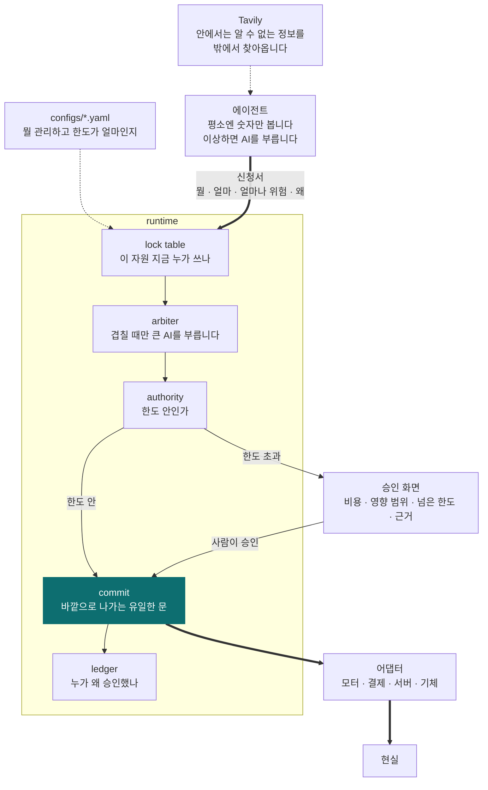
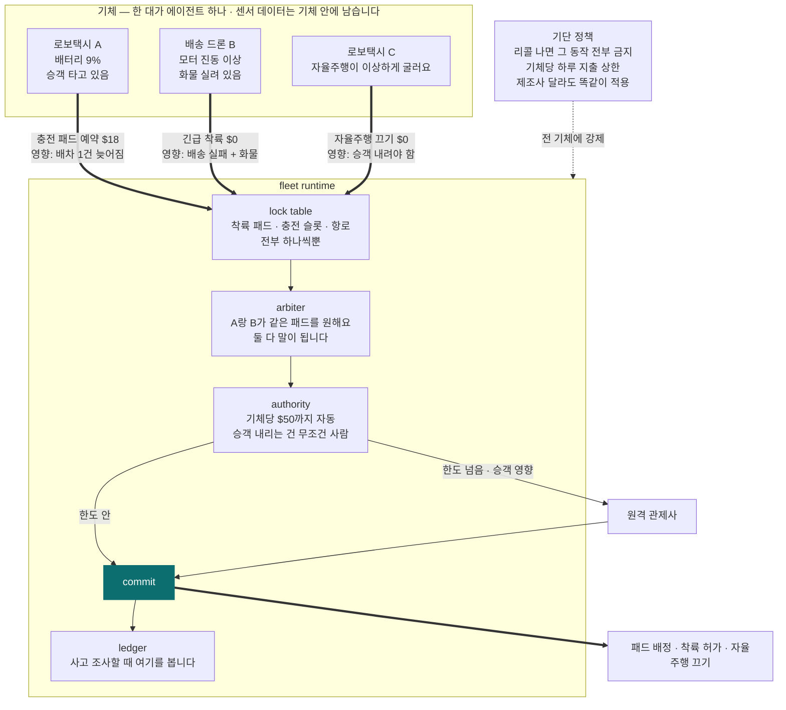

# Attaché

**에이전트는 신청만 합니다. 실행은 런타임만 합니다.**

*[English](README.en.md)*

---

## 무슨 문제를 푸나요

공장에 AI 에이전트 셋이 돌고 있다고 해봅시다.

- 안전 담당: "진동이 이상해요. 기계 멈춥시다"
- 운영 담당: "지금 멈추면 납기 놓쳐요. 계속 돌립시다"
- 정비 담당: "부품 34만원어치 주문할게요"

셋 다 틀린 말이 아닙니다. 그럼 **누가 결정하나요?**

지금은 정하는 사람이 없습니다. 그래서 회사들이 AI한테 실제 권한을 안 줍니다. 사람이 하나하나
확인하고 넘어갑니다. AI를 붙여놨는데 결국 사람이 다 들여다보고 있으면 붙인 보람이 없죠.

## 어떻게 푸나요

**법인카드랑 똑같이 합니다.**

직원이 회사 통장에서 직접 돈을 빼지는 않습니다. 결제를 *신청*합니다. 한도 안이면 그냥 통과되고,
넘으면 팀장이 봅니다. 누가 신청했고 누가 승인했는지는 기록으로 남고요.

Attaché는 AI 에이전트한테 이 구조를 그대로 씌운 겁니다.

- 에이전트는 **행동을 못 합니다.** "이거 하고 싶어요"라고 신청서만 낼 수 있습니다
- 신청서에는 **얼마 드는지, 잘못되면 어디까지 영향이 가는지**를 같이 적습니다
- 런타임이 한도를 보고 자동으로 통과시키거나, 사람을 부릅니다
- 에이전트 둘이 같은 걸 원하면 런타임이 골라줍니다
- 기계를 실제로 멈추거나 돈을 실제로 쓰는 코드는 **런타임 안에 딱 하나** 있습니다

에이전트 코드에는 `execute()`가 아예 없습니다. 그게 핵심입니다.

## 왜 이런 게 필요해졌나요

AI는 같은 상황에서도 어제와 오늘 다르게 답할 수 있습니다. 그래서 **"이 AI는 절대 실수 안 합니다"라고
보증해줄 방법이 없습니다.** 보증이 안 되는 걸 진짜 기계나 진짜 돈에 연결하려면 방법은 하나뿐입니다.

AI 머릿속을 통제하려고 애쓰지 말고, **AI가 실제로 할 수 있는 행동에만 울타리를 치는 겁니다.**

그런데 지금 그 울타리를 만들어주는 도구가 없습니다.

### 이미 나와 있는 것들과 뭐가 다른가요

NVIDIA랑 Nebius가 만든 걸 다 찾아봤습니다. **전부 "호출 하나"를 다루는 도구입니다.**

| 이미 있는 것 | 하는 일 | 못 하는 것 |
|---|---|---|
| MCP / A2A | 에이전트를 도구에 연결 | 연결만 해줍니다. 판단은 안 합니다 |
| NeMo Guardrails | 위험한 호출을 막습니다 | 호출 하나에 예/아니오. 신청 셋 중에 뭘 고를지는 모릅니다 |
| NeMo Relay | 호출을 추적하고 차단·재시도 | 마찬가지로 호출 하나 단위입니다 |
| NeMo Agent Toolkit | 에이전트를 만들고 평가 | 만드는 도구입니다. 권한 개념이 없습니다 |
| Nebius Token Factory | 모델을 돌려줍니다 | 인프라입니다 |
| Nebius AI Cloud 거버넌스 | 계정 권한, 쿼터, 격리 | 클라우드 관리지 에이전트 결정 권한이 아닙니다 |

**아직 아무도 안 하는 것 넷:**

1. 에이전트 셋이 서로 다른 걸 원할 때 **누구 말을 들을지**
2. 같은 자원을 둘이 동시에 쓰려고 할 때 **막는 것**
3. **얼마까지** 사람 없이 쓰게 할지
4. 여러 에이전트에 걸친 결정을 **하나의 기록으로** 남기는 것

가드레일은 *나쁜* 요청을 막습니다. Attaché는 *다 괜찮아 보이는* 요청 중에서 하나를 고릅니다.
비슷해 보이지만 완전히 다른 일입니다.

### 겹치는 게 아니라 밑에 깔리는 겁니다

Nebius가 최근에 **Echo**를 냈습니다. 말로 클라우드 인프라를 조작하는 AI 에이전트입니다.

> Echo가 "이 서버 지울게요" 하면, 누가 승인하나요?

Attaché는 이런 도구들이랑 싸우지 않습니다. 그 밑에 깔립니다.

---

## 구조



에이전트가 모터를 직접 못 건드립니다. 무조건 `commit`을 거쳐야 합니다.
그림에서 화살표가 전부 거기로 모이는 게 그 이유입니다.

| 파일 | 하는 일 |
|---|---|
| `runtime` | 자원 잠그고, 겹치면 골라주고, 한도 보고, 실행하고, 기록합니다 |
| `agent` | 감시하고 신청합니다. 실행은 못 합니다 |
| `adapters` | 현실을 건드리는 유일한 코드. 런타임만 부를 수 있습니다 |
| `configs` | 뭘 관리하는지, 한도가 얼마인지 |
| `ui` | 한도를 넘었을 때 사람이 보는 승인 화면 |

## 진짜 필요해지는 곳: 사람이 안 타는 기체

지금 자동차는 마지막에 운전자가 결정합니다. **로보택시랑 배송 드론에는 그 사람이 없습니다.**
"누가 승인했어요?"라고 물었을 때 대답할 사람 자체가 사라집니다.



**여기서는 피할 방법이 없습니다.**

- **사람이 없습니다.** 운전석도 조종석도 비어 있어요. 승인은 시스템이 해야 합니다
- **자원이 진짜로 하나뿐입니다.** 착륙 패드가 하나인데 두 대가 동시에 내려오면 부딪힙니다
- **기체가 돈을 씁니다.** 충전료, 착륙료, 견인비. 한도 없이 맡길 수는 없습니다
- **회사가 여럿 섞입니다.** 한 도시에 여러 업체 기체가 돌아다닙니다. 리콜이 나오면 어디에 거나요?
- **사고 나면 첫 질문이 "누가 시켰냐"입니다.** 지금은 "AI가 알아서 했어요"밖에 답이 없고,
  그걸로는 보험 처리도 안 되고 조사도 안 끝납니다

항공 관제가 있긴 합니다. 그런데 관제는 **비행기들이 안 부딪히게 길을 갈라주는 일**을 합니다.
이 기체가 40만원을 써도 되는지, 안전 담당과 배송 담당 중에 누구 말을 들을지는 관제 소관이 아닙니다.

한 회사가 기체부터 소프트웨어까지 다 만들면 자기 관제 시스템이 있습니다.
문제는 **여러 회사 게 섞였을 때**입니다. 그때 공통으로 규칙을 걸 자리가 없습니다.

## 신청 하나가 지나가는 길

```
에이전트 ── 평소엔 그냥 숫자만 봅니다 (AI 안 씀)
     │  이상하면 → 작은 AI가 판단 → 필요하면 Tavily로 밖에서 정보 찾기
     ▼
  신청서: 뭘 할 건지, 얼마 드는지, 얼마나 위험한지, 왜 그렇게 판단했는지
════════════ 여기부터는 에이전트가 못 들어옵니다 ════════════
     ▼
  이 자원 누가 쓰고 있나? ──쓰는 중──► 겹치니까 큰 AI가 골라줍니다
     ▼
  한도 안인가? ──넘음──► 사람한테 물어봅니다
     ▼
  실행 ──────────────────► 모터 정지 / 환불 처리 / 착륙 허가
     ▼
  기록: 누가 신청했고, 무슨 근거였고, 어느 한도를 통과했나
```

## 분야가 바뀌어도 코드는 그대로입니다

런타임은 모터가 뭔지 환불이 뭔지 모릅니다. 설정 파일만 갈아끼우면 됩니다.

```
attache run configs/robot.yaml      # 모터가 멈춥니다
attache run configs/finance.yaml    # 환불이 승인됩니다
attache run configs/fleet.yaml      # 착륙 패드가 배정됩니다
```

같은 프로그램, 같은 승인 절차, 같은 기록.

## AI는 아껴 씁니다

에이전트가 8,000개인데 전부 AI를 돌리면 요금을 감당 못 합니다.
**평소에는 AI를 아예 안 부릅니다.** 이상할 때만 작은 모델, 정말 애매할 때만 큰 모델을 씁니다.

| 언제 | 뭘 쓰나 |
|---|---|
| 평소 | 그냥 숫자 비교. AI 안 씁니다 |
| 뭔가 이상할 때 | Nemotron 3 Nano — 30B (실제로는 3B만 작동) |
| 원인을 알아내야 할 때 | Nemotron 3 Super — 100B (10B 작동) |
| 신청이 겹쳐서 골라야 할 때 | Nemotron 3 Ultra — 550B (55B 작동) |

전부 Nebius Token Factory에서 돌립니다.

## 기본 개념 8개

| 이름 | 뜻 |
|---|---|
| `asset` | 관리 대상 하나 (기계 한 대, 기체 한 대, 계정 하나) |
| `subsystem` | 그 안의 부품 (모터, 배터리, 센서) |
| `signal` | 관찰된 것 (진동 수치, 로그 한 줄) |
| `resource` | 한 번에 하나만 쓸 수 있는 것 (착륙 패드, 예산) |
| `proposal` | 신청서 |
| `commit` | 실행 |
| `escalation` | 언제 더 큰 AI를 부를지 |
| `authority` | 한도 |

기록은 아홉 번째 개념이 아닙니다. **기록 없이는 실행 자체가 안 되게 만들어놨습니다.**

---

## 상태

이제 시작했습니다. Nebius × NVIDIA Global AI Hackathon 2026, Physical AI 트랙.
대회 관련 정리는 [HACKATHON.md](HACKATHON.md).

## 라이선스

Apache-2.0
