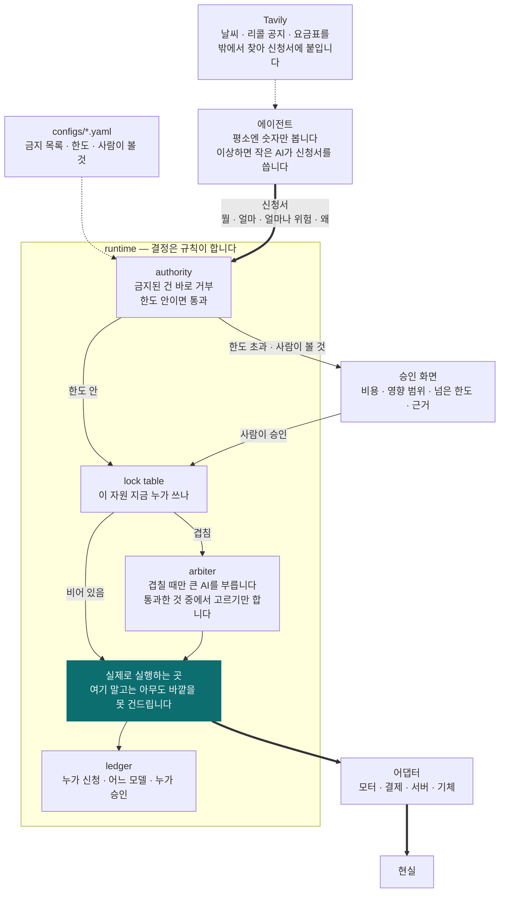
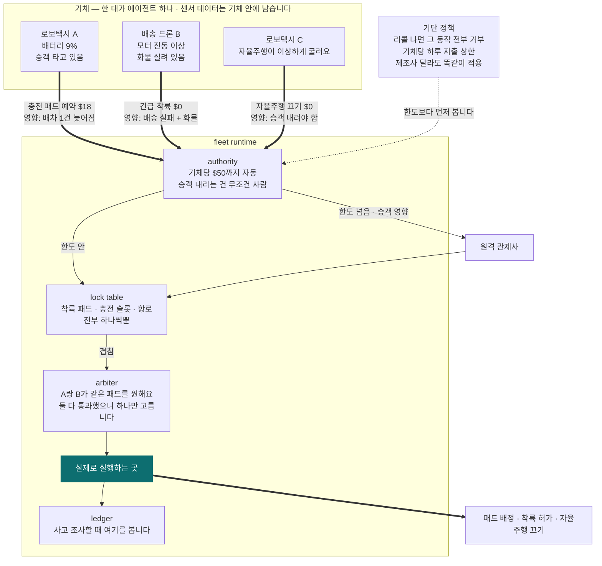

# Attaché

**에이전트는 신청만 합니다. 실행은 런타임만 합니다.**
**AI는 결정권자가 아닙니다. 비행기 세계의 규칙이 이미 그렇게 정해놨습니다.**

*[English](README.en.md)*

---

## 무슨 문제를 푸나요

공장에 AI 에이전트 셋이 돌고 있다고 해봅시다.

- 안전 담당: "진동이 이상해요. 기계 멈춥시다"
- 운영 담당: "지금 멈추면 납기 놓쳐요. 계속 돌립시다"
- 정비 담당: "부품 34만원어치 주문할게요"

셋 다 틀린 말이 아닙니다. 그럼 **누가 결정하나요?**

지금은 정하는 사람이 없습니다. 그래서 회사들이 AI한테 실제 권한을 안 줍니다. 사람이 하나하나
확인하고 넘어갑니다. AI를 붙여놨는데 결국 사람이 다 들여다보고 있으면 붙인 보람이 없죠.

## 어떻게 푸나요

**법인카드랑 똑같이 합니다.**

직원이 회사 통장에서 직접 돈을 빼지는 않습니다. 결제를 *신청*합니다. 한도 안이면 그냥 통과되고,
넘으면 팀장이 봅니다. 누가 신청했고 누가 승인했는지는 기록으로 남고요.

Attaché는 AI 에이전트한테 이 구조를 그대로 씌운 겁니다.
(런타임이라고 부르는 건 그냥 **계속 켜져 있는 프로그램 하나**입니다. 켜두면 안 꺼지고 계속 돕니다.)

- 에이전트는 **행동을 못 합니다.** "이거 하고 싶어요"라고 신청서만 낼 수 있습니다
- 신청서에는 **얼마 드는지, 잘못되면 어디까지 영향이 가는지**를 같이 적습니다
- 런타임이 금지 목록과 한도를 보고 자동으로 통과시키거나, 사람을 부릅니다
- 에이전트 둘이 같은 걸 원하면 런타임이 골라줍니다
- 기계를 실제로 멈추거나 돈을 실제로 쓰는 코드는 **런타임 안에 딱 하나** 있습니다

마지막 줄이 제일 중요합니다. 모터를 끄는 코드, 결제를 보내는 코드는 런타임 안에만 있습니다.
에이전트 쪽에는 그런 코드가 아예 없어요. 그래서 에이전트가 아무리 이상하게 굴어도
신청서를 이상하게 쓸 수 있을 뿐, 직접 뭘 해버릴 수가 없습니다.

## 왜 AI는 결정권자가 될 수 없나요

AI는 같은 질문에 어제와 오늘 다르게 답할 수 있습니다. 그래서 **"이 AI는 절대 실수 안 합니다"라고
보증해줄 방법이 없습니다.** 보증이 안 되는 걸 진짜 기계나 진짜 돈에 연결하려면 방법은 하나뿐입니다.

AI 머릿속을 통제하려고 애쓰지 말고, **AI가 실제로 할 수 있는 행동에만 울타리를 치는 겁니다.**

이건 우리가 지어낸 말이 아닙니다. **비행기 세계는 이미 이렇게 합니다.**

- 유럽 항공청(EASA)의 AI 기준안은 AI를 **목숨이 걸린 최고 안전등급 기능의 결정권자로 두지 않습니다.**
  AI는 도와줄 수 있고, 같이 일할 수 있지만, 마지막 결정은 검증된 프로그램이나 사람이 합니다
- 미국 표준 ASTM F3269는 이렇게 말합니다. **"믿을 수 없는 프로그램은 믿을 수 있는 감시기로
  감싸라. 감시기가 선을 넘는 걸 잡으면 검증된 쪽이 대신 움직인다."** 이걸 런타임 보증이라고 부릅니다

그러니까 "에이전트는 신청만, 실행은 런타임만"은 새로운 발상이 아니라, **비행기가 이미 지키는 규칙을
그대로 가져온 것**입니다.

### 그런데 울타리가 비행기 몸에만 쳐져 있습니다

위 규칙들은 전부 **기체가 어떻게 움직이느냐**만 봅니다. 조종면, 충돌 회피, 하늘길 나누기.
그 위에서 벌어지는 결정에는 울타리가 없습니다.

| 이미 있는 것 | 하는 일 | 안 하는 것 |
|---|---|---|
| 비행 조종 소프트웨어 기준 (DO-178C) | 조종 코드가 틀리지 않게 만듭니다 | AI가 아예 못 들어갑니다 |
| 런타임 보증 (ASTM F3269) | 믿을 수 없는 함수를 감시기로 감쌉니다 | 기체 한 대의 비행 동작만 봅니다 |
| 하늘길 관제 (UTM, ASTM F3548) | 여러 회사 기체가 안 부딪히게 하늘을 나눕니다 | 땅 위 착륙 패드, 충전기, 돈은 안 봅니다 |
| AI 인증 틀 (EASA, ED-324) | AI를 어느 등급까지 쓸지 정합니다 | "결정은 AI가 하지 마라"까지만 말합니다 |
| 사고 보고 (FAA Part 108안) | 사고 나면 운영 회사가 보고합니다 | AI가 뭘 신청했고 누가 승인했는지 적는 형식이 없습니다 |
| 에이전트 도구들 (MCP, NeMo Guardrails, Relay …) | 호출 하나를 연결하고, 막고, 추적합니다 | 신청 셋 중에 뭘 고를지는 모릅니다 |

가드레일은 *나쁜* 요청을 막습니다. Attaché는 *다 괜찮아 보이는* 요청 중에서 하나를 고릅니다.
비슷해 보이지만 완전히 다른 일입니다.

### 우리가 파는 자리 다섯

1. **땅 위 자원.** 착륙 패드, 충전 슬롯, 배터리 교환소. 하늘길은 표준이 있는데 땅은 없습니다
2. **돈.** 기체가 충전료, 착륙료, 견인비를 얼마까지 사람 없이 써도 되는지. 아무 표준도 안 정합니다
3. **리콜.** "지금부터 이 기종의 이 동작은 전부 금지"를 회사가 달라도 한 번에 거는 것
4. **기록.** AI가 뭘 신청했고, 어느 모델이 썼고, 어느 한도를 통과했고, 누가 승인했는지.
   사고 보고서에 그대로 들어가는 형식으로
5. **사람이 볼 것 표시.** "승객 내리는 건 무조건 사람"처럼 행동마다 사람이 끼는지 아닌지를
   설정 파일에 적어두는 것. EASA가 말하는 사람-AI 협업 등급을 기계가 읽게 적은 셈입니다

Wing이나 Zipline처럼 한 회사가 기체부터 소프트웨어까지 다 만들면 자기 시스템이 있습니다.
문제는 **여러 회사 게 한 도시에 섞였을 때**입니다. 그때 공통으로 규칙을 걸 자리가 없습니다.
Attaché는 그 자리에 깔립니다.

---

## 구조



순서가 중요합니다. **한도 검사가 먼저고, AI 중재는 나중입니다.** 중재자(큰 AI)는 이미 한도를
통과한 신청서 중에서 하나를 고를 뿐, 새 행동을 만들어낼 수 없습니다. 목록에 없는 답을 내면 버리고
규칙대로 정하거나 사람을 부릅니다. 이래야 F3269가 말하는 "감시기가 마지막"이 지켜집니다.

모터를 실제로 끄는 코드는 런타임 안에 딱 한 군데 있습니다. 에이전트는 그 코드를 부를 수 없어요.
부를 수 있는 건 런타임뿐입니다. 그림에서 화살표가 전부 한 군데로 모이는 게 그 뜻입니다.

| 파일 | 하는 일 |
|---|---|
| `runtime` | 금지 목록 보고, 한도 보고, 자원 잠그고, 겹치면 골라주고, 실행하고, 기록합니다 |
| `agent` | 감시하고 신청합니다. 실행은 못 합니다 |
| `adapters` | 현실을 건드리는 유일한 코드. 런타임만 부를 수 있습니다 |
| `configs` | 뭘 관리하는지, 뭐가 금지인지, 한도가 얼마인지, 어떤 모델을 쓰는지 |
| `ui` | 한도를 넘었을 때 사람이 보는 승인 화면 |

## 진짜 필요해지는 곳: 사람이 안 타는 기체

지금 자동차는 마지막에 운전자가 결정합니다. **로보택시랑 배송 드론에는 그 사람이 없습니다.**
"누가 승인했어요?"라고 물었을 때 대답할 사람 자체가 사라집니다.



**여기서는 피할 방법이 없습니다.**

- **사람이 없습니다.** 운전석도 조종석도 비어 있어요. 승인은 시스템이 해야 합니다
- **자원이 진짜로 하나뿐입니다.** 착륙 패드가 하나인데 두 대가 동시에 내려오면 부딪힙니다
- **기체가 돈을 씁니다.** 충전료, 착륙료, 견인비. 한도 없이 맡길 수는 없습니다
- **회사가 여럿 섞입니다.** 한 도시에 여러 업체 기체가 돌아다닙니다. 리콜이 나오면 어디에 거나요?
- **사고 나면 첫 질문이 "누가 시켰냐"입니다.** 지금은 "AI가 알아서 했어요"밖에 답이 없고,
  그걸로는 보험 처리도 안 되고 조사도 안 끝납니다

항공 관제가 있긴 합니다. 그런데 관제는 **비행기들이 안 부딪히게 길을 갈라주는 일**을 합니다.
이 기체가 40만원을 써도 되는지, 안전 담당과 배송 담당 중에 누구 말을 들을지는 관제 소관이 아닙니다.

## 신청 하나가 지나가는 길

```
에이전트 ── 평소엔 그냥 숫자만 봅니다 (AI 안 씀)
     │  이상하면 → 작은 AI가 신청서를 씁니다 → 필요하면 Tavily로 밖에서 근거를 찾습니다
     ▼
  신청서: 뭘 할 건지, 얼마 드는지, 얼마나 위험한지, 왜 그렇게 판단했는지
════════════ 여기부터는 에이전트가 못 들어옵니다 ════════════
     ▼
  금지된 동작인가? ──예──► 바로 거부. AI한테 물어보지도 않습니다
     ▼
  한도 안인가? ──넘음──► 사람한테 물어봅니다
     ▼
  이 자원 누가 쓰고 있나? ──겹침──► 큰 AI가 통과한 것 중에서 하나만 고릅니다
     ▼
  실행 ──────────────────► 모터 정지 / 환불 처리 / 착륙 허가
     ▼
  기록: 누가 신청했고, 어느 모델이 썼고, 어느 한도를 통과했고, 누가 승인했나
```

## AI는 세 가지 일만 합니다. 결정은 안 합니다

에이전트가 8,000개인데 전부 AI를 돌리면 요금을 감당 못 합니다.
**평소에는 AI를 아예 안 부릅니다.** 이상할 때만 작은 모델, 정말 애매할 때만 큰 모델을 씁니다.

| 언제 | 뭘 쓰나 | 하는 일 | 못 하는 일 |
|---|---|---|---|
| 평소 | 없음. 그냥 숫자 비교 | | |
| 뭔가 이상할 때 | Nemotron 3 Nano — 30B (실제로는 3B만 작동) | 신청서 쓰기 | 실행 |
| 원인을 알아내야 할 때 | Nemotron 3 Super — 100B (10B 작동) | 신청서에 "왜"를 붙이기 | 결정 |
| 신청이 겹쳐서 골라야 할 때 | Nemotron 3 Ultra — 550B (55B 작동) | 통과한 것 중 하나 고르기 | 새 행동 만들기 |

전부 NVIDIA 오픈 모델이고, Nebius Token Factory에서 돌립니다.

**기체 위에서는 작은 걸 씁니다.** 배송 드론 컴퓨터(Jetson Orin Nano, 8GB)에는 30B가 안 들어갑니다.
거기서는 Nemotron Nano 9B v2를 씁니다. 64GB급(AGX Orin, Thor)이면 30B 그대로 올립니다.
GPU가 없으면 Token Factory에 물어봅니다. **어느 쪽이든 에이전트 코드는 똑같고, 모델 주소만 바뀝니다.**

### 모델을 어떻게 다루나

AI가 결정권자가 아니려면 **모델 답을 받는 방식**이 정해져 있어야 합니다.

- **답은 정해진 양식으로만 받습니다.** 신청서 양식이 아니면 버립니다. 문장으로 "이거 하세요"라고
  와도 소용없습니다
- **고를 때는 번호만 답합니다.** 목록에 없는 번호면 버리고, 미리 정한 규칙(안전 > 승객 > 비용)으로
  정하거나 사람을 부릅니다
- **어느 모델 어느 버전이 썼는지 기록합니다.** `configs/models.yaml`에 버전을 고정하고, 신청서마다
  모델 이름과 버전이 같이 남습니다. 사고 조사 때 "그때 그 모델"을 다시 돌려볼 수 있습니다
- **모델이 안 답하면 규칙으로 신청서를 씁니다.** 그것도 안 되면 사람입니다. 링크가 끊긴 드론도
  "긴급 착륙 신청"은 낼 수 있어야 합니다

Tavily도 같은 규칙입니다. 날씨, 리콜 공지, 요금표를 밖에서 찾아서 **신청서에 근거로 붙이는 일**만
합니다. 리콜 공지를 찾으면 그것도 "정책 신청서"가 됩니다. 사람이 승인하면 전 기체에 걸립니다.

## 분야가 바뀌어도 코드는 그대로입니다

런타임은 모터가 뭔지 환불이 뭔지 모릅니다. 설정 파일만 갈아끼우면 됩니다.

```
attache run configs/robot.yaml      # 모터가 멈춥니다
attache run configs/finance.yaml    # 환불이 승인됩니다
attache run configs/fleet.yaml      # 착륙 패드가 배정됩니다
```

같은 프로그램, 같은 승인 절차, 같은 기록.

## 기본 개념 9개

| 이름 | 뜻 |
|---|---|
| `asset` | 관리 대상 하나 (기계 한 대, 기체 한 대, 계정 하나) |
| `subsystem` | 그 안의 부품 (모터, 배터리, 센서) |
| `signal` | 관찰된 것 (진동 수치, 로그 한 줄) |
| `resource` | 한 번에 하나만 쓸 수 있는 것 (착륙 패드, 예산) |
| `proposal` | 신청서 |
| `policy` | 전 기체 금지 규칙 (리콜 등). 한도보다 먼저 봅니다 |
| `authority` | 한도. 그리고 사람이 꼭 봐야 하는 행동 목록 |
| `escalation` | 언제 더 큰 AI를 부를지 |
| `commit` | 실제로 실행하는 코드. 여기만 현실을 건드립니다 |

기록은 열 번째 개념이 아닙니다. **기록 없이는 실행 자체가 안 되게 만들어놨습니다.**

---

## 상태

이제 시작했습니다. Nebius × NVIDIA Global AI Hackathon 2026, Physical AI 트랙.
대회 관련 정리는 [HACKATHON.md](HACKATHON.md).

## 라이선스

Apache-2.0
