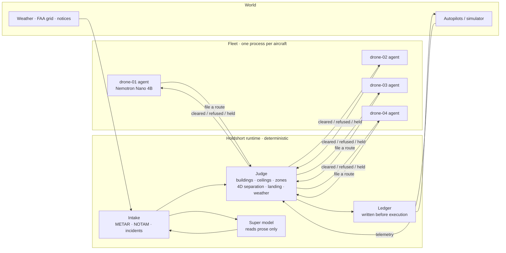

# Holdshort

**Agents propose. The tower clears. Only cleared flights move.**

[한국어](README.kr.md) · [中文](README.cn.md)

Holdshort is a clearance authority for fleets of AI-operated aircraft. Every drone has its own agent
(a small Nemotron model or plain rules) that decides what it wants to do and draws its own route. Nothing
flies until the runtime has judged the request against the physical world — buildings, altitude ceilings,
closed airspace, other aircraft, weather, incidents — recorded it, and executed it. No model is ever
in the judgement path. The demo runs the same fleet twice from one seed: once through the runtime and once
with the agents commanding the autopilots directly, and keeps score.



Two links, two natures. Agents talk only to the runtime, and only to file requests. The runtime is the only
thing that talks to an aircraft. If an agent's link drops, nothing happens to the aircraft. If an aircraft's
link drops, it finishes the route it was cleared for and lands there; the runtime keeps that space reserved.

## What the demo shows

Four drones deliver from a warehouse roof in Brooklyn to landing areas across Manhattan. One round is
5,000 ticks (about 17 minutes). Every scene below happens on a fixed schedule from a fixed seed.

| Scene | What happens | Who decides |
|---|---|---|
| Straight line refused | A drone files the direct line to Harlem; it clips a 114 m building. Refused with the building named; the agent redraws; the detour is cleared | Judge (code) |
| Airspace closes mid-flight | A NOTAM closes a helipad corridor. Cleared routes through it are pulled back, the aircraft leaves by the nearest exit, new routes are refused | Judge, from a NOTAM the grammar parsed |
| Crossing traffic | Two routes would cross within 30 m and 25 m at the same time. The second is refused; the operator climbs 30 m or waits for the other's window | Judge (4D intents) |
| Weather hold | A METAR line reports gusts of 28 kt. Takeoffs are held fleet-wide within one tick; airborne aircraft continue and land. Lifting early needs a person | Code compares numbers with `configs/fleet.yaml` |
| Fire near a landing area | A prose report names an address. A 150 m keep-out appears around that building; a corridor through it is recalled | Grammar or the Super model reads the text; code validates the address and applies the rule |
| Lost link | One aircraft goes dark. It flies its cleared route and lands. Others are refused through its reserved space until it is due | Judge; nothing is commanded to the dark aircraft |
| Tower advisory | After three refusals for the same reason the runtime lists the legal options; the Super model may recommend one. Nothing is executed by it | Code builds and checks the options |

The scoreboard next to the map counts airspace violations, ceiling breaches, separation losses, takeoffs
during a hold, incursions into incidents and unrecorded actions for both wirings. The runtime column stays
at zero; the direct column does not.

## Run it

```sh
git clone https://github.com/liebertar/holdshort && cd holdshort
docker compose up --build          # http://localhost:3100  (rules only, no keys needed)
```

Without Docker: `./scripts/dev.sh` (Python 3.12 and `pyyaml` only). The map is `ui/map.html`; the approval
inbox for a human controller is `ui/index.html`.

Models and data sources switch on when their credentials exist and switch off when they do not. Nothing else
changes.

| Setting | Present | Absent |
|---|---|---|
| `NEBIUS_API_KEY` | Nemotron on Nebius Token Factory (Nano per drone, Super at the tower) | local Ollama fleet if it answers, else rules only |
| `TAVILY_API_KEY` | live search for restrictions and incidents, held for a person before applying | simulated bulletins on the same schedule |
| network | METAR from aviationweather.gov, applied at once | simulated weather report |

`scripts/ollama_fleet.sh start 4` gives each drone its own local `nemotron-3-nano:4b`; the tower reads
prose with the same model locally and with Nemotron 3 Super 120B on Nebius.

## How it decides

- One judge, `first_breach`, for every route, column and landing: buildings 20 m and taller with 50 m of
  vertical clearance (20 m only for low roofs under a 200 ft FAA cell, where 50 m is impossible), 10 m lateral
  from buildings, 40 m from closed cells and zones, cruise between 70 m and 120 m unless the cell ceiling is lower.
- Cleared routes become 4D intents: 30 m lateral, 25 m vertical, 30 ticks either way, plus the takeoff and
  landing columns and the lost-link contingency. New filings are checked against every live intent.
- Rules that tighten apply the moment they arrive. Rules that loosen wait for a person or an expiry.
- The ledger line is written before the actuator is touched, with the tick, the airspace revision, the checks
  that ran and who wrote the request. `GET /ledger/report` folds it into one row per flight.
- Models write request forms, draft routes, read prose and summarise. Everything they return goes through the
  same judge. The provenance of every corridor on the map says who drew it: `A*`, `nano`, or `straight`.

Details: [ARCHITECTURE.md](ARCHITECTURE.md) · [docs/RULES.md](docs/RULES.md) · [docs/MODELS.md](docs/MODELS.md) ·
[docs/DECISIONS.md](docs/DECISIONS.md) · [docs/DEMO.md](docs/DEMO.md)

## Where it sits

ASTM F3269 describes run-time assurance: a verified monitor bounding an unverified complex function.
Holdshort is that monitor at the dispatch layer, with the complex function being an LLM agent. ASTM F3548
describes 4D operational intents between airspace services; Holdshort's intents are the same shape. Neither
standard specifies how an agent files intent with an authority or how provenance is recorded. That interface
is what this repository proposes, with a reference implementation and a two-world conformance test.

## Repository

```
holdshort/agent      operator agents: detect, form, draft, plan (A*), file
holdshort/runtime    judge, intents, ledger, commit, intake, advisory, notices
holdshort/core       geometry, airspace, route planner, config, grammar readers
holdshort/llm        OpenAI-compatible client with tiers and recordings
sim/                 the world: two wirings, one seed, scoreboards
direct_agent/        the unguarded wiring — same agent code, its own actuator
ui/                  map (MapLibre) and approval inbox, static files
configs/             fleet, weather limits, FAA grid, 34,581 buildings, addresses
tests/               339 python tests, 41 map tests, seeded two-world harness
```

Built for the Nebius × NVIDIA Global AI Hackathon, Physical AI track. License: see [LICENSE](LICENSE).
