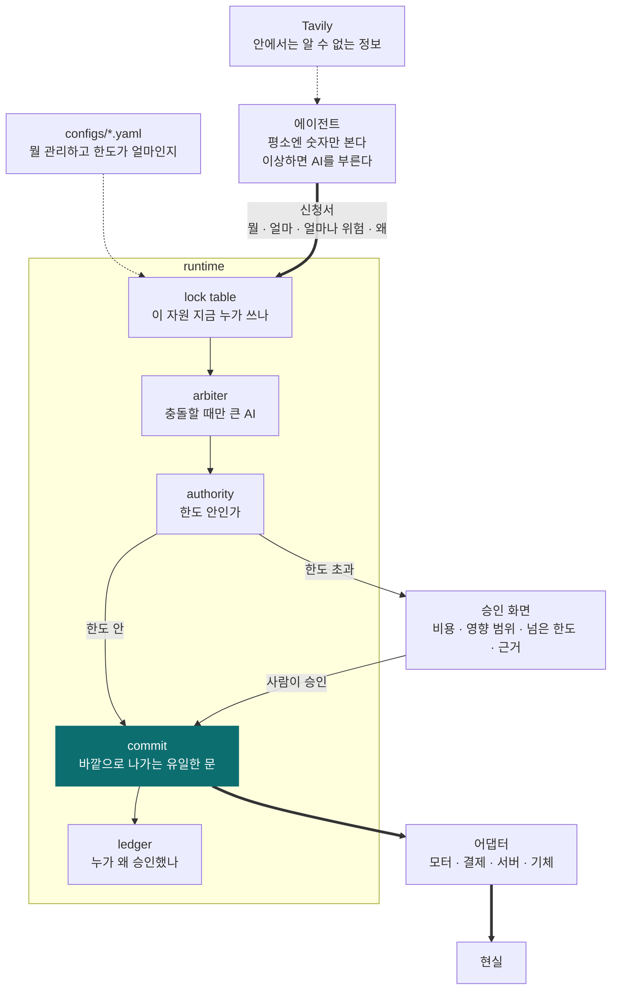
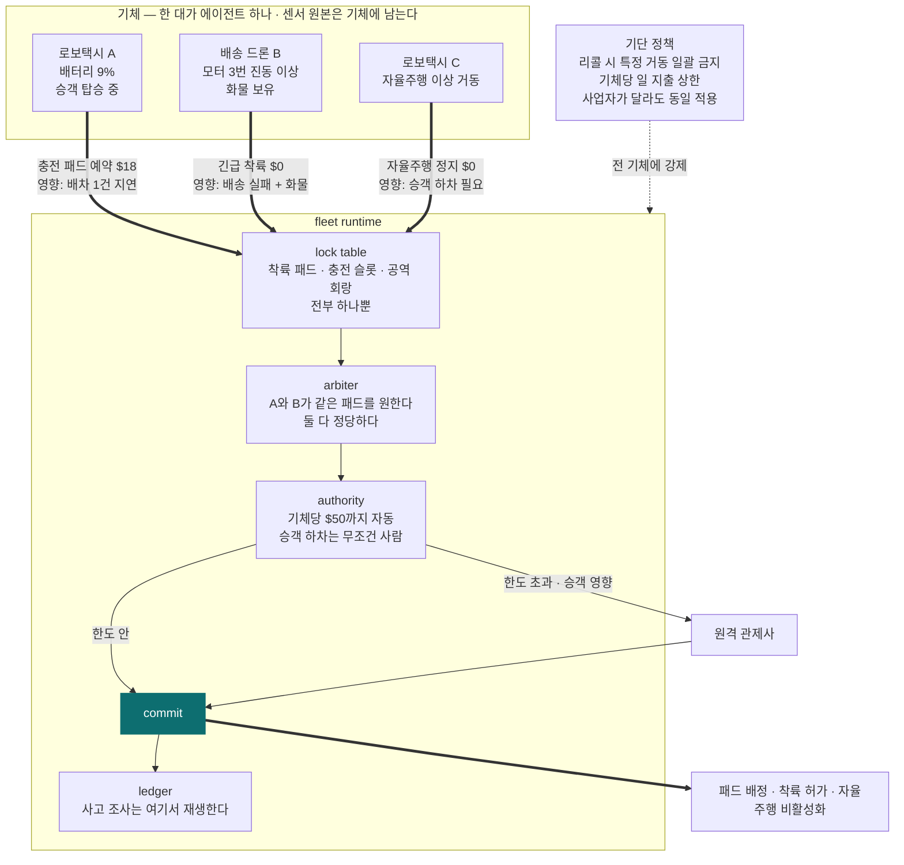

# Attaché

**에이전트는 신청만 한다. 실행은 런타임만 한다.**

*[English](README.en.md)*

---

## 무슨 문제를 푸는가

공장에 AI 에이전트 셋이 돌고 있다고 하자.

- 안전 에이전트: "진동이 이상해요. 기계 멈춥시다"
- 운영 에이전트: "지금 멈추면 납기 놓쳐요. 계속 돌립시다"
- 정비 에이전트: "부품 34만원어치 주문할게요"

셋 다 나름 맞는 말이다. **그럼 누가 결정하나?**

지금은 답이 없다. 그래서 현장에서는 AI에게 실제 권한을 안 준다. 사람이 하나하나 확인한다.
AI를 붙여놨는데 결국 사람이 다 보고 있으면 붙인 의미가 없다.

## 어떻게 푸는가

**법인카드랑 똑같이 한다.**

직원은 카드를 긁는 게 아니라 결제를 *신청*한다. 한도 안이면 자동으로 통과되고, 넘으면 팀장이 본다.
그리고 누가 신청했고 누가 승인했는지 기록이 남는다. 직원이 회사 계좌를 직접 건드릴 수는 없다.

Attaché는 AI 에이전트를 위한 그 시스템이다.

- 에이전트는 **행동하지 못한다.** "이거 하고 싶다"고 신청만 할 수 있다
- 신청에는 **얼마 드는지, 얼마나 위험한지**를 같이 적어야 한다
- 런타임이 한도를 보고 자동 승인하거나, 사람을 부른다
- 여러 에이전트가 같은 걸 원하면 런타임이 중재한다
- 실제로 기계를 멈추거나 돈을 쓰는 코드는 **런타임 안에 딱 하나** 있다

에이전트 코드에는 `execute()`가 없다. 그게 전부다.

## 왜 이게 필요한가

AI는 같은 상황에서도 매번 다르게 답할 수 있다. 그래서 **"이 AI는 절대 실수 안 합니다"라고 보증할 방법이 없다.**

보증할 수 없는 걸 실제 기계나 실제 돈에 붙이려면 방법은 하나뿐이다.
AI가 무슨 생각을 하는지 통제하려 들지 말고, **AI가 실제로 할 수 있는 행동에 울타리를 친다.**

지금 그 울타리를 만들어주는 물건이 없다.

### 이미 있는 것들과 뭐가 다른가

NVIDIA와 Nebius가 만든 것들을 다 찾아봤다. **전부 "호출 하나"를 다루는 도구다.**

| 이미 있는 것 | 하는 일 | 못 하는 것 |
|---|---|---|
| MCP / A2A | 에이전트를 도구에 연결 | 연결만 해준다. 판단은 안 한다 |
| NeMo Guardrails | 위험한 호출을 막는다 (execution rail) | 호출 하나에 예/아니오. 신청 셋 중에 뭘 고를지는 모른다 |
| NeMo Relay | 호출을 추적하고 차단·재시도·라우팅 | 같음. 실행 하나 단위 |
| NeMo Agent Toolkit | 에이전트를 만들고 평가하고 관측 | 만드는 도구다. 권한 개념 없음 |
| Nebius Token Factory | 모델을 서빙 | 인프라다 |
| Nebius AI Cloud governance | IAM, 쿼터, 워크로드 격리 | 클라우드 거버넌스. 에이전트 결정 권한이 아님 |

**아무도 안 하는 것:**

- 에이전트 셋이 서로 다른 걸 원할 때 **누가 이기는지**
- 같은 자원을 둘이 동시에 쓰려 할 때 **막는 것**
- **얼마까지** 자동으로 쓰게 할지
- 여러 에이전트에 걸친 결정을 **하나의 기록으로** 남기는 것

가드레일은 *나쁜* 요청을 막는다. Attaché는 *다 괜찮은* 요청 중에 하나를 고른다. 다른 문제다.

### 겹치기는커녕 필요한 쪽이다

Nebius는 AI Cloud 3.6에 **Echo**를 냈다. 자연어로 클라우드 인프라를 조작하는 에이전트다.

> Echo가 서버를 지우겠다고 하면, 누가 승인하나?

Attaché는 이런 도구들과 경쟁하지 않는다. 그 아래에 깔린다.

---

## 구조



에이전트에서 `현실`로 가는 직선이 없다. **모든 선이 `commit`을 지난다.**

| 파일 | 하는 일 |
|---|---|
| `runtime` | 자원 잠금, 중재, 한도 검사, 실행, 기록 |
| `agent` | 감시하고 신청한다. 실행은 못 한다 |
| `adapters` | 현실을 건드리는 유일한 코드. 런타임만 부를 수 있다 |
| `configs` | 뭘 관리하는지, 한도가 얼마인지 |
| `ui` | 한도를 넘었을 때 사람이 보는 승인 화면 |

## 이게 진짜 필요해지는 곳: 무인 기체

지금 자동차는 운전자가 최후의 승인자다. **로보택시와 무인 항공기에는 그 사람이 없다.**
"누가 승인했나"에 대한 대체 답이 사라진다.



**왜 여기서 피할 수 없는가**

- **사람이 없다.** 운전석도 조종석도 비어 있다. 승인 주체를 시스템이 가져야 한다
- **자원이 진짜로 하나뿐이다.** 착륙 패드, 충전 패드, 공역 회랑, 정류 슬롯. 두 대가 동시에 잡으면 사고다
- **기체가 돈을 쓴다.** 충전, 착륙료, 우선 슬롯, 견인. 한도 없이 자율 지출은 성립하지 않는다
- **사업자가 여럿이다.** 한 도시에 여러 회사 기체가 섞인다. 리콜이나 규제 변경을 **어디에 걸 것인가**
- **사고가 나면 첫 질문이 "누가 승인했나"다.** 지금 답은 "AI가 했다"이고, 그건 규제기관도 보험사도 받지 않는다

항공 관제는 **경로를 분리**한다. 기체가 얼마를 써도 되는지, 안전 에이전트와 배송 에이전트 중 누가 이기는지는
다루지 않는다. 한 회사가 전부 만드는 경우엔 자체 관제면이 있다. 문제는 **섞였을 때**다.

## 신청 하나가 지나가는 길

```
에이전트 ── 평소엔 그냥 숫자만 본다 (AI 안 씀)
     │  이상하면 → 작은 AI가 판단 → 필요하면 Tavily로 밖에서 정보 찾기
     ▼
  신청서: 뭘 할 건지, 얼마 드는지, 얼마나 위험한지, 왜 그렇게 판단했는지
════════════ 여기부터는 에이전트가 못 들어온다 ════════════
     ▼
  이 자원 누가 쓰고 있나? ──쓰는 중──► 중재 (큰 AI, 충돌할 때만)
     ▼
  한도 안인가? ──넘음──► 사람한테 승인 요청
     ▼
  실행 ──────────────────► 모터 정지 / 환불 처리 / 서버 조치
     ▼
  기록: 누가 신청했고, 무슨 근거였고, 어느 한도를 통과했나
```

## 도메인이 바뀌어도 코드는 안 바뀐다

런타임은 모터도 환불도 모른다. 설정 파일만 바꾸면 된다.

```
attache run configs/robot.yaml      # 모터가 멈춘다
attache run configs/finance.yaml    # 환불이 승인된다
```

같은 프로그램, 같은 승인 절차, 같은 기록.

## AI를 아껴 쓴다

에이전트가 8,000개인데 전부 AI를 돌리면 요금이 감당이 안 된다.
**평소엔 AI를 아예 안 부른다.** 이상할 때만 작은 모델, 정말 애매할 때만 큰 모델.

| 언제 | 뭘 쓰나 |
|---|---|
| 평소 | 그냥 숫자 비교. AI 안 씀 |
| 뭔가 이상할 때 | Nemotron 3 Nano — 30B (실제로 3B만 작동) |
| 원인을 알아내야 할 때 | Nemotron 3 Super — 100B (10B 작동) |
| 신청이 충돌해서 골라야 할 때 | Nemotron 3 Ultra — 550B (55B 작동) |

Nebius Token Factory에서 돌린다.

## 기본 개념 8개

`asset` 관리 대상 · `subsystem` 그 안의 부품 · `signal` 관찰된 것 · `resource` 하나만 쓸 수 있는 것
`proposal` 신청 · `commit` 실행 · `escalation` 언제 큰 AI를 부를지 · `authority` 한도

기록은 아홉 번째 개념이 아니다. **모든 실행에 기록이 붙어 있어야 실행이 된다.**

---

## 상태

초기. Nebius × NVIDIA Global AI Hackathon 2026, Physical AI 트랙.
대회 정리는 [HACKATHON.md](HACKATHON.md).

## 라이선스

Apache-2.0
