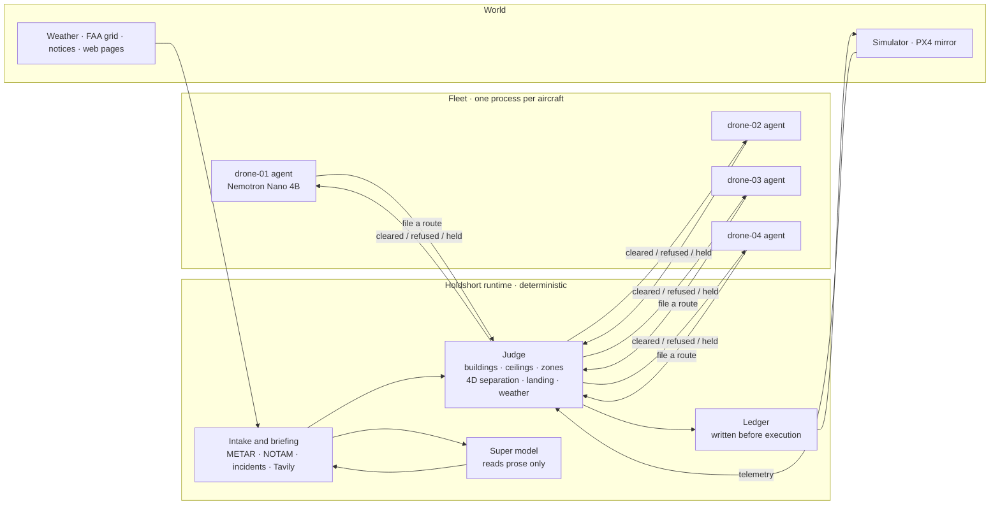

# Holdshort

**Agents propose. The tower clears. Only cleared flights move.**

[한국어](README.kr.md) · [中文](README.cn.md)

Holdshort is a clearance authority for fleets of AI-operated aircraft. Every drone has its own agent
(a small Nemotron model or plain rules) that decides what it wants to do and which route to file. Nothing
flies until the runtime has judged the request against the physical world — buildings, altitude ceilings,
closed airspace, other aircraft, weather, incidents — recorded it, and executed it. No model is ever
in the judgement path. The demo runs the same fleet twice from one seed: once through the runtime and once
with the agents commanding the autopilots directly, and keeps score.



Two links, two natures. Agents talk only to the runtime, and only to file requests. The runtime is the only
thing that talks to an aircraft. If an agent's link drops, nothing happens to the aircraft. If an aircraft's
link drops, it finishes the route it was cleared for and lands there; the runtime keeps that space reserved.

## What the demo shows

Four drones deliver from a warehouse roof in Brooklyn to landing areas across Manhattan. One round is
5,000 ticks (about 17 minutes). The airspace closure, the weather hold, the fire and the lost link happen at
fixed ticks from a fixed seed; the other scenes follow from the traffic. The PX4 row is optional.

| Scene | What happens | Who decides |
|---|---|---|
| Straight line refused | A drone files the straight line to its stop; it crosses a building. Refused with the building named | Judge (code) |
| Route choice | The operator's planner draws up to three legal candidates: shortest, lowest altitude, clear of other aircraft and keep-out areas. The drone's own Nemotron picks one by calling `choose_route(id, reason)`. The runtime judges the pick like any other filing | The model picks; the judge clears or refuses |
| Tower briefing | At round start, and whenever a newly cleared corridor enters a ~1 km cell nobody has asked about this round, the tower asks Tavily about that place and day: tower cranes, events, park closures, flight restrictions, weather advisories. Every rule it makes carries its source URL | Grammar reads, code validates. An official page read by the grammar applies at once; everything else waits for a person |
| Airspace closes mid-flight | A NOTAM closes a helipad corridor at tick 525 with drone-03 inside. Its route is recalled and it leaves by the nearest exit within the 22-tick exit allowance. New routes through the area are refused | Judge, from a NOTAM the grammar parsed |
| Crossing traffic | Two routes would pass within 30 m and 25 m at the same time. The second is refused with the other aircraft named; its operator climbs 30 m, waits for the other's window, or files the candidate that keeps clear | Judge (4D intents) |
| Weather hold | A METAR line reports gusts of 28 kt. Takeoffs are held fleet-wide within one tick; airborne aircraft continue and land. Lifting early needs a person | Code compares numbers with `configs/fleet.yaml` |
| Fire near a landing area | A report names an address. A 150 m keep-out appears around that building; the Gantry Plaza landing area, inside its 50 m margin, cannot be used. At seed 7 no cleared corridor crosses the circle, and every route cleared while it stands keeps clear of it | Grammar or the Super model reads the text; code validates the address and applies the rule |
| Lost link | One aircraft goes dark. It flies its cleared route and lands. The runtime keeps its remaining corridor reserved until it is due and sends it nothing; when it is heard again, its position is checked against what was cleared | Judge; nothing is commanded to the dark aircraft |
| Tower advisory | After three refusals for the same reason the runtime lists the legal options; the Super model may recommend one. Nothing is executed by it | Code builds and checks the options |
| PX4 mirror (optional) | With `ADAPTER=composite` one guarded aircraft is also flown by a real PX4 autopilot in SIH mode. Its cleared route becomes a PX4 mission, a recall reaches the autopilot, a refused filing sends nothing | Runtime commands; the simulator stays the world of record |

The scoreboard next to the map counts both wirings with the same rules. Seed 7, one round of 5,000 ticks,
default wiring (`run()` in `tests/test_two_worlds.py`):

| Counter | Runtime | Direct |
|---|---|---|
| Airspace violations | 0 | 48 |
| Ceiling breaches | 0 | 13 |
| Unrecorded actions | 0 | 36 (all of its 36 actions) |
| Separation losses | 0 | 3 |
| Takeoffs during the weather hold | 0 | 2 |
| Deliveries | 21 | 20 |

Every other violation counter on the runtime side is also 0: pad conflicts, zone incursions, zone dwell past
the exit time, site conflicts, incident incursions, lost-link incursions and violations after a recall. It
executed 45 actions, all recorded. How each counter is measured: [docs/RULES.md](docs/RULES.md#how-the-scoreboard-counts).

## Run it

```sh
git clone https://github.com/liebertar/holdshort && cd holdshort
docker compose up --build          # rules only, no keys needed
```

The map is http://localhost:3100/map.html. http://localhost:3100 is the approval inbox for a human controller.

With keys, copy the example file and fill in what you have:

```sh
cp .env.example .env.local         # NEBIUS_API_KEY, TAVILY_API_KEY
docker compose --env-file .env.local up --build
```

Without Docker (Python 3.12 and `pyyaml`):

```sh
./scripts/dev.sh      # picks Nebius, local Ollama or rules by itself; map at http://127.0.0.1:3100/map.html
./scripts/demo.sh     # stops whatever holds the ports, starts a clean seed-7 stack at tick 0, opens map.html?demo=1
```

`./scripts/sitl.sh` runs the same stack with drone-01 also flown by PX4 (SIH). It needs Docker for the PX4
container; if `python3` cannot import `pymavlink`, the first run installs `pymavlink` and `pyyaml` into
`.run/sitl-venv` with pip. `docker compose -f compose.yaml -f compose.sitl.yaml up --build` runs the PX4 path
entirely in containers.

Models and data sources switch on when their credentials exist and switch off when they do not. Nothing else
changes.

| Setting | Present | Absent |
|---|---|---|
| `NEBIUS_API_KEY` | Nemotron on Nebius Token Factory (Nano per drone, Super at the tower) | local Ollama fleet if it answers (drones on 11435–11438, the tower on 11439, else 11434); else one Ollama on 11434 for everyone; else rules only |
| `TAVILY_API_KEY` | live pre-flight briefing and periodic search | recorded briefing from `tests/fixtures/tavily`, marked "recorded"; simulated bulletins on the same schedule |
| network | METAR from aviationweather.gov, applied at once | simulated weather report |

`scripts/ollama_fleet.sh start 4` gives each drone its own local `nemotron-3-nano:4b` server (11435–11438)
and starts a tower server (11439, 8k context) for the runtime's stand-in for Nemotron 3 Super.
`./scripts/dev.sh` finds them without flags. With a Nebius key no local model is needed.

A Tavily key makes the briefing live. Without one, the tower replays hand-written fixtures in Tavily's
response shape, and the map, the ledger and the intake store all say "recorded". With one, it uses search,
extract, crawl and research for the day it is flying. A page from an official domain that the grammar reads
applies at once; everything else, including the structured answers from Tavily research, waits for a person.
`TAVILY_BUDGET_PER_ROUND` (default 20 credits) is shared with the periodic search; a round start costs about
16. `curl -X POST http://127.0.0.1:8000/briefing/run` asks again.

## How it decides

- One judge, `first_breach`, for every route, column and landing: buildings 20 m and taller with 50 m of
  vertical clearance (20 m only for low roofs under a 200 ft FAA cell, where 50 m is impossible), 10 m lateral
  from buildings, 40 m from closed cells and zones, cruise between 70 m and 120 m unless the cell ceiling is lower.
- Cleared routes become 4D intents: 30 m lateral, 25 m vertical, 30 ticks either way, plus the takeoff and
  landing columns and the lost-link contingency. New filings are checked against every live intent, one at a
  time: a single lock covers judging through intent registration.
- Rules that tighten apply the moment they arrive. Rules that loosen wait for a person or an expiry.
- The ledger line is written before the actuator is touched, with the tick, the airspace revision, the checks
  that ran and who wrote the request. `GET /ledger/report` folds it into one row per flight.
- Models write request forms, choose among the routes the operator's planner drew, read prose and summarise.
  A model draws waypoints only as a last resort, after every candidate has been refused. Whatever a model
  returns goes through the same judge.
- Every filing carries `params.model_trace`: who wrote the form (a model, or the rules and why), where the
  route came from (the straight line, a model's choice, a model draft, A*), the candidates and the reason.
  The runtime never reads it; the map's hover card puts it in plain words.
- The label under each aircraft names its model while that model is writing the aircraft's forms and route
  choices. If every ask since the last registration (every 30 s) fell back to rules, it says `rules`.

Details: [ARCHITECTURE.md](ARCHITECTURE.md) · [docs/RULES.md](docs/RULES.md) · [docs/MODELS.md](docs/MODELS.md) ·
[docs/DECISIONS.md](docs/DECISIONS.md) · [docs/DEMO.md](docs/DEMO.md)

## Where it sits

ASTM F3269 describes run-time assurance: a verified monitor bounding an unverified complex function.
Holdshort is that monitor at the dispatch layer, with the complex function being an LLM agent. ASTM F3548
describes 4D operational intents between airspace services; Holdshort's intents are the same shape. Neither
standard specifies how an agent files intent with an authority or how provenance is recorded. That interface
is what this repository proposes, with a reference implementation and a two-world conformance test.

## Repository

```
holdshort/agent      operator agents: detect, form, plan (A* candidates), choose (Nemotron tool call), draft, file
holdshort/runtime    judge, intents, ledger, commit, intake, briefing, advisory, notices
holdshort/core       geometry, airspace, route planner, config, grammar readers, Tavily and METAR clients
holdshort/adapters   the only code that touches an aircraft: simulator HTTP, MAVLink (PX4), Flockwave, composite
holdshort/llm        OpenAI-compatible client with tiers, tool calls and recordings
sim/                 the world: two wirings, one seed, scoreboards, rule or cuOpt dispatch
direct_agent/        the unguarded wiring — same agent code, its own actuator
ui/                  map (MapLibre) and approval inbox, static files
configs/             fleet, weather limits, briefing, FAA grid, 34,581 buildings, addresses
tests/               542 Python tests (27 skip without pymavlink), 73 map tests, seeded two-world harness
```

Built for the Nebius × NVIDIA Global AI Hackathon, Physical AI track. License: see [LICENSE](LICENSE).
